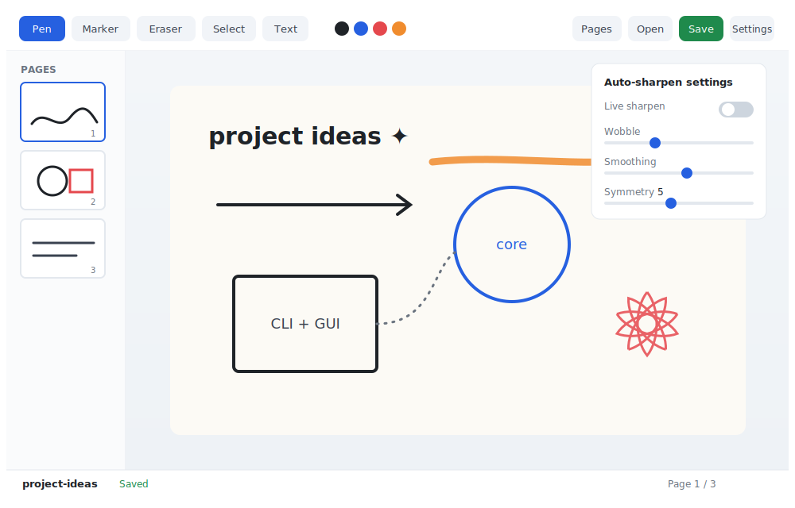

# napkin-sketch

Quick and easy computer sketching with a drawing GUI that simulates pen and
paper/napkin sketching — featuring an **auto-sharpen** algorithm that turns
stiff, computer-drawn strokes into cleaner, more hand-drawn forms.

Draw with a **mouse, touchscreen, or pen** (pressure-aware), then let
napkin-sketch straighten your lines, round out your circles, square up your
boxes, and re-introduce a subtle organic wobble so the result still reads as
hand-drawn rather than vector-perfect.



## Features

- **Pen, marker, eraser, select, and text** tools with pressure-aware variable
  line width. The eraser truly reveals the paper beneath (layered compositing),
  the Select tool moves/deletes existing strokes (with rubber-band selection),
  and the Text tool supports both **click-to-type** (auto-sizing box) and
  **drag-to-draw** (fixed-width box with word-wrap).
- **Touchscreen + mouse + stylus** input via Pointer Events (with coalesced
  sampling for smooth, high-frequency capture).
- **Auto-sharpen engine** that recognizes intent (straight line, circle/ellipse,
  polygon, or freeform) and rebuilds an idealized, hand-drawn version.
  - **Live sharpen** (off by default) — beautify each stroke the moment you lift
    the pen.
  - **Sharpen all** — clean up an entire page (or a saved file) at once.
  - **Sharpen settings panel** — tune wobble, smoothing, circle snap, end taper,
    rotational **symmetry** (mandala mode), and text size.
- **Sketchbook pages** with a toggleable **thumbnail panel**, page-turn
  animation, and add/delete/navigate controls — flip back to any earlier page.
- **Native application menus** — *File* (New, Open, Save, Save As, Export
  PNG / JPEG / SVG) and *Edit* (Undo, Redo).
- **Image export** to PNG (transparent), JPEG (flattened), or **SVG** (lossless
  vector). Each format offers **Export current page** or **Export all pages**
  (saves `name_1.ext`, `name_2.ext`, …).
- **CapsLock cursor** — crosshair while CapsLock is on; a circle matching the
  current stroke width when off.
- **Multi-page sketch books** saved as portable `.skbk` JSON files.
- **Undo / redo**, clear, custom ink colors, and keyboard shortcuts.
- **Embeddable API** — drop the same editor into a website, WordPress block, or
  VS Code webview (see [Embedding](#embedding-the-editor)).
- **Installable desktop app** with a Start-menu/desktop shortcut and app icon
  (via electron-builder).
- Calm, accessible UI (WCAG-AA contrast, reduced-motion support).

## Installation

### Desktop app (recommended)

The easiest way to install napkin-sketch is to build a native installer for
your OS using **electron-builder**. Each command builds the project and then
packages it into a platform installer placed in the `release/` folder.

#### Windows

```bash
npm install
npm run dist:win
```

This produces an **NSIS installer** (`release/Napkin Sketch Setup *.exe`).
Run the installer — it adds a **Start Menu** entry and an optional desktop
shortcut. No administrator rights are required (per-user install).

To uninstall: *Settings → Apps → Napkin Sketch → Uninstall*.

#### macOS

```bash
npm install
npm run dist:mac
```

This produces a **DMG disk image** (`release/Napkin Sketch-*.dmg`).
Open the DMG, drag **Napkin Sketch** into your `Applications` folder, then
eject the disk image. Launch via Launchpad or Spotlight.

> **Gatekeeper note**: On first launch macOS may say the app is from an
> unidentified developer. Right-click (or Control-click) the app icon, choose
> **Open**, then click **Open** in the dialog. You only need to do this once.

#### Linux

```bash
npm install
npm run dist:linux
```

This produces an **AppImage** (`release/Napkin Sketch-*.AppImage`). Make it
executable and run it directly — no installation needed:

```bash
chmod +x "release/Napkin Sketch-*.AppImage"
./release/"Napkin Sketch-*.AppImage"
```

To integrate with your desktop environment (application menu, file manager),
use a tool such as `appimaged` or `AppImageLauncher`, or create a `.desktop`
file manually.

### Build-and-run from source (all platforms)

Requires **Node.js 18+** and a compatible Electron version.

```bash
npm install
npm run build
npm start          # builds then opens a new blank sketch
```

To install the `napkin-sketch` CLI globally from a local checkout:

```bash
npm install
npm run build
npm link
napkin-sketch      # launches from anywhere
```

Once published to npm it can be installed directly:

```bash
npm install -g napkin-sketch
```

## Usage

```bash
napkin-sketch [option] [target]
```

| Parameter        | Description                                                          |
| :--------------- | :------------------------------------------------------------------ |
| `-h, --help`     | Show help for using the application from the command line.           |
| `-v, --version`  | Show the current version of the application.                         |
| `-b, --book`     | Open a saved sketch book file, using the `.skbk` extension.          |
| `-n, --new`      | New sketch, using `unnamed` or the name passed as `[target]`.        |
| `--sharpen`      | Auto-sharpen a saved sketch so it appears more hand-drawn, then open.|
| `[target]`       | A `.skbk` file to open, or a name for a new sketch file.             |

### Examples

```bash
# Open a new, blank sketch
napkin-sketch

# New sketch named "ideas"
napkin-sketch --new ideas

# Open an existing sketch book
napkin-sketch --book ./notes.skbk

# Auto-sharpen a saved book on disk, then open it
napkin-sketch --sharpen ./notes
```

A bare path is treated as a sketch book to open:

```bash
napkin-sketch ./notes.skbk
```

## In-app controls

| Action                 | Shortcut                                  |
| :--------------------- | :---------------------------------------- |
| Pen                    | `P`                                       |
| Marker                 | `M`                                       |
| Eraser                 | `E`                                       |
| Select                 | `S`                                       |
| Text                   | `T`                                       |
| Sharpen all            | `H`                                       |
| Sharpen settings       | `Ctrl/Cmd + ,`                            |
| Toggle pages           | `Ctrl/Cmd + B`                            |
| Undo                   | `Ctrl/Cmd + Z`                            |
| Redo                   | `Ctrl/Cmd + Y` or `Ctrl/Cmd + Shift + Z`  |
| Save                   | `Ctrl/Cmd + S`                            |
| Save As                | `Ctrl/Cmd + Shift + S`                    |
| Delete selection       | `Delete` or `Backspace`                   |

**Text tool:** *click* to place an auto-sizing text box; *drag* to draw a
fixed-width text box (text wraps to fit the drawn width).

**Select tool:** *click* a stroke to select and drag it; *drag over empty
space* to rubber-band-select multiple strokes at once.

**CapsLock cursor:** while any drawing tool is active, **CapsLock on** shows a
precision crosshair; **CapsLock off** shows a circle preview matching the
current stroke width.

**Live sharpen is off by default.** Toggle it in the **Settings** panel to
beautify strokes automatically as you draw, or leave it off and use **Sharpen
all** when you are ready. The Settings panel also exposes wobble, smoothing,
circle snap, end taper, rotational symmetry, and text size.

## How auto-sharpen works

Each stroke runs through a four-stage pipeline:

1. **Resample + denoise** — even out the raw pointer samples and remove jitter
   (uniform resampling + Ramer–Douglas–Peucker simplification).
2. **Recognize intent** — classify the stroke as a line, circle/ellipse,
   polygon, or freeform curve (least-squares circle fit, corner detection,
   straightness test).
3. **Rebuild** — regenerate an idealized version of the detected shape while
   preserving its size, position, and winding direction.
4. **Humanize** — re-apply subtle, deterministic value-noise *wobble*, taper the
   stroke ends, and anchor endpoints so the result looks hand-drawn rather than
   mechanically perfect.

The engine is pure and deterministic (seeded from each stroke's id), so the same
stroke sharpens identically whether it is processed live in the GUI or headless
via `napkin-sketch --sharpen`.

## The `.skbk` file format

A sketch book is a human-readable JSON document:

```jsonc
{
  "format": "napkin-sketch",
  "version": 1,
  "name": "notes",
  "sketches": [
    {
      "id": "sk_…",
      "name": "unnamed",
      "width": 1280,
      "height": 800,
      "background": "#fcfaf5",
      "strokes": [
        {
          "id": "st_…",
          "tool": "pen",
          "color": "#1f2328",
          "width": 3,
          "sharpened": true,
          "points": [{ "x": 12, "y": 34, "pressure": 0.6 }]
        }
      ],
      "createdAt": "…",
      "updatedAt": "…"
    }
  ],
  "createdAt": "…",
  "updatedAt": "…"
}
```

Files are saved atomically (write-then-rename) so an interrupted save cannot
corrupt an existing book.

## Embedding the editor

The same drawing engine ships as a **framework-agnostic, browser-safe** package
with no Electron or Node dependencies. Use it on a website, in a WordPress
block, or inside a VS Code webview.

With a bundler (ESM):

```ts
import { NapkinSketch } from 'napkin-sketch';
import 'napkin-sketch/styles.css';

const editor = new NapkinSketch(document.getElementById('host')!, {
  liveSharpen: false, // off by default, like the desktop app
  onChange: (e) => console.log(e.toJSON()),
});

editor.setTool('pen');
editor.sharpenAll();
const png = editor.toDataURL('image/png');
```

Via a plain `<script>` tag (the IIFE build exposes a global `napkin`):

```html
<div id="host" style="width: 640px; height: 420px"></div>
<script src="node_modules/napkin-sketch/dist/embed/napkin-sketch.js"></script>
<script>
  const editor = new napkin.NapkinSketch(document.getElementById('host'));
</script>
```

You can also import just the pure engine (no DOM) to sharpen strokes yourself:

```ts
import { sharpenStrokes, parseSketchBook } from 'napkin-sketch';
```

## Packaging a desktop installer

napkin-sketch builds native installers with **electron-builder** (configured in
`package.json`). The app icon is generated from `assets/icon.svg` at build time.

```bash
npm run build      # bundle into dist/ (also writes assets/icon.png)
npm run dist       # build an installer for the current OS
npm run dist:win   # Windows NSIS installer (Start-menu + desktop shortcut)
```

The Windows NSIS installer registers a Start-menu entry and desktop shortcut
named **Napkin Sketch** and lets the user choose the install directory.

## Testing

Unit tests use Node's built-in test runner. The TypeScript sources are bundled
on the fly by esbuild, so no separate compile step is needed.

```bash
npm test
```

Suites cover the geometry utilities, the auto-sharpen classifier and transforms,
`.skbk` serialization/normalization, the CLI argument parser, and the launch
contract.

## Project structure

```
src/
├── cli/index.ts        # Command-line entry (arg parsing, GUI launch, headless sharpen)
├── main/
│   ├── main.ts         # Electron main process, native menus, image export, IPC
│   └── preload.ts      # Secure window.napkin bridge
├── renderer/
│   ├── index.html      # GUI markup (toolbar, pages panel, settings panel)
│   ├── styles.css      # GUI styling (60-30-10, WCAG-AA)
│   ├── renderer.ts     # UI wiring + pointer input
│   ├── surface.ts      # High-DPI, two-layer canvas rendering engine
│   └── store.ts        # App state + undo/redo history
├── sharpen/
│   ├── geometry.ts     # Geometry & curve utilities
│   └── sharpen.ts      # Auto-sharpen engine
├── api/
│   ├── index.ts        # Public, browser-safe API barrel
│   └── embed.ts        # Embeddable NapkinSketch editor
└── core/
    ├── types.ts        # Shared data model
    ├── serialize.ts    # Browser-safe .skbk (de)serialization + validation
    ├── sketchbook.ts   # .skbk file I/O (atomic writes)
    ├── paths.ts        # Dependency-free path helpers
    ├── launch.ts       # CLI ↔ main launch contract
    └── ipc.ts          # IPC channel + bridge types
```

## Development

```bash
npm run build        # Bundle CLI, main, preload, renderer, and the embed API
npm run build:watch  # Rebuild on change
npm run build:types  # Emit .d.ts declarations for the embeddable API
npm run typecheck    # Type-check without emitting
npm test             # Run the unit test suites
npm run start        # Build, then launch a new sketch
npm run clean        # Remove dist/
```

The build uses **esbuild** to bundle the Node-side code (CommonJS), the renderer
(browser IIFE), and the embeddable API (ESM + IIFE); `tsc` is used only for
type-checking and for emitting the public type declarations.

## License

MIT
