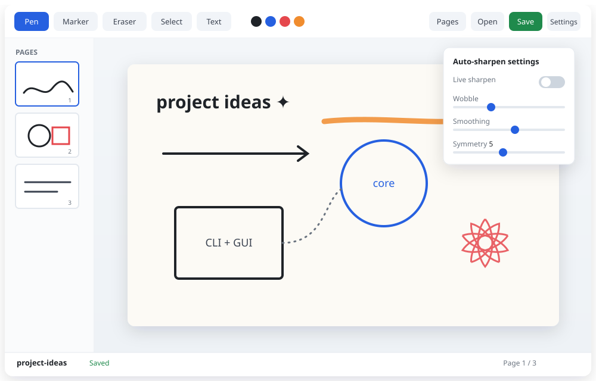

# napkin-sketch

Quick and easy computer sketching with a drawing GUI that simulates pen and
paper/napkin sketching — featuring an **auto-sharpen** algorithm that turns
stiff, computer-drawn strokes into cleaner, more hand-drawn forms.

Draw with a **mouse, touchscreen, or pen** (pressure-aware), then let
napkin-sketch straighten your lines, round out your circles, square up your
boxes, and re-introduce a subtle organic wobble so the result still reads as
hand-drawn rather than vector-perfect.



## Features

- **Pen, marker, Copic marker, eraser, select, direct select, and text**
  tools with pressure-aware variable line width. The eraser truly reveals the
  paper beneath (layered compositing), the Select tool moves/deletes existing
  strokes (with rubber-band and `Shift`-click multi-selection), the **Direct
  Select** tool (`A`) drags individual **anchor points** to reshape a stroke,
  and the Text tool supports both **click-to-type** (auto-sizing box) and
  **drag-to-draw** (fixed-width box with word-wrap).
- **Copic marker** (`K`) — simulates an alcohol-ink marker's flat **broad nib**:
  strokes are thick when you pull across the nib and thin when you pull along
  it, like a real chisel tip. The nib is **rotatable**: hold `Ctrl` for one
  second to show a rotation indicator in the bottom-right corner, then hold
  `Alt` to rotate the nib clockwise or `Shift` to rotate it counter-clockwise;
  release `Ctrl` to finish. The hold time (0.5–2s), all three keys, the
  rotation speed, and the feature's on/off switch are configurable in the
  Settings window.
- **Touchscreen + mouse + stylus** input via Pointer Events (with coalesced
  sampling for smooth, high-frequency capture).
- **Pan and zoom** with a two-finger gesture (pan within a small threshold, zoom
  beyond it), the **mouse wheel** (`Alt` + wheel zooms, plain wheel pans,
  `Ctrl+Shift` + wheel pans across — all directions configurable), or the
  **Select tool with `Space` + drag**, plus **straight-line drawing** (hold
  `Space` and drag with a drawing tool).
- **Quick features** — press `W` then a number for stroke width, `Q` then a
  number for opacity, `Z` then a digit to zoom (`9` = 90%, `0` = 100%), or
  `C` / `Shift + C` to cycle the **Quick Access Colors**.
- **Endpoint snap** — hold `Shift` while drawing to snap the stroke's start and
  end to the nearest endpoint of an existing stroke (a ring marks the target).
  Works for freehand, straight-line, and curve drawing; the snap sensitivity
  (1–20px, default 10px) and an on/off switch live in the settings. The
  optional **Join stroke** setting (off by default) merges a snapped stroke
  with the stroke it touches into one continuous stroke.
- **Sketch Support tools** — a second toolbar section with **Rectangle**
  (`R`, `Shift` for a square), **Ellipse** (`L`, `Shift` for a circle),
  **Curve** (`V`: drag a chord that starts and ends at nearby stroke
  endpoints by default, bend, click to place — click and hold the button for
  the free-ends variant, or hold `Ctrl+Space` and drag with any tool),
  **Paint Bucket** (`G`: fill an enclosed shape as a new selectable shape),
  **Fill Color** (fill the selected element — or the element under the click —
  with the selected color), **Eyedropper** (`I`: pick a color from the canvas
  and fill the selected shape), and **Join strokes** (`Ctrl+J`).
- **Fill Shape** — with the Select tool active and a shape selected, clicking
  a Quick Access Color fills the shape with it. Fills are honored by the
  canvas, thumbnails, and SVG/PDF export.
- **Layer groups** — `Ctrl+G` groups the active layer (nesting allowed);
  group visibility, lock, and opacity apply to every layer inside, and
  `Ctrl+Shift+G` ungroups.
- **Two synced settings views** — **Quick Settings** in-app (`Ctrl+,`: live
  sharpen, wobble, smoothing, circle snap, taper, symmetry, text size) and
  the **Verbose Settings** window (`Ctrl+Alt+,`, Edit menu, or the gear icon)
  which holds those same Quick Settings plus zoom/pan sensitivity, inverted
  zoom, the quick-feature timer, endpoint snap and Join stroke, the
  eyedropper's select pixel sensitivity, the Copic quick nib-rotate options
  (on/off, hold time, hold/rotate keys, rotation speed), Quick Access Color
  count and values, toolbar placement (top / side / both) with drag-and-drop
  **rearrange mode** (covers every tool in both toolbar groups — tools can
  even move between the groups — plus the Quick Access Colors), a light /
  dark / sepia **theme**, and auto-save. Settings
  persist across launches and can be exported to and imported from a JSON file.
- **Auto-sharpen engine** that recognizes intent (straight line, circle/ellipse,
  polygon, or freeform) and rebuilds an idealized, hand-drawn version.
  - **Live sharpen** (off by default) — beautify each stroke the moment you lift
    the pen.
  - **Sharpen all** — clean up an entire page (or a saved file) at once.
  - **Sharpen settings panel** — tune wobble, smoothing, circle snap, end taper,
    rotational **symmetry** (mandala mode), and text size.
- **Layers** — every page has a layer stack with per-layer **opacity**,
  **visibility**, **lock**, **rename**, and **reordering** (`Ctrl + L` opens
  the panel), managed like a common vector editor: every **new element gets
  its own layer**, `Shift`-click **multi-selects** rows, canvas selection and
  panel selection **highlight each other**, group rows **expand/collapse**,
  rows **drag-and-drop** to reposition or to nest inside a group, and
  deleting an element deletes its emptied layer (deleting a layer deletes its
  elements). Drawing, erasing, and selection respect the active layer, and
  the eraser only cuts holes in its own layer.
- **Sketchbook pages** with a toggleable **thumbnail panel**, page-turn
  animation, and add/delete/navigate controls — flip back to any earlier page.
- **Native application menus** — *File* (New, Open, Import, Save, Save As,
  Export PNG / JPEG / SVG / PDF) and *Edit* (Undo, Redo).
- **Export** to PNG (transparent), JPEG (flattened), **SVG** (lossless vector,
  layers preserved as groups), or **PDF** (vector, no extra dependencies). Each
  format offers **Export current page** or **Export all pages** — raster and
  SVG save `name_1.ext`, `name_2.ext`, …, while PDF writes all pages into one
  document.
- **Import** (`Ctrl + I`) of **SVG** (vector shapes become editable strokes,
  top-level groups become layers, and **nested groups become nested,
  collapsible layer groups** — napkin-sketch's own exports round-trip
  losslessly), **PDF** (each page's vector content becomes a new sketch page,
  best effort), and **PNG / JPEG** (placed as a movable image on the active
  layer).
- **CapsLock cursor** — crosshair while CapsLock is on; a circle matching the
  current stroke width when off.
- **Multi-page sketch books** saved as portable `.skbk` JSON files.
- **Undo / redo**, clear, custom ink colors, and keyboard shortcuts.
- **Embeddable API** — drop the same editor into a website, WordPress block, or
  VS Code webview (see [Embedding](#embedding-the-editor)).
- **Installable desktop app** with a Start-menu/desktop shortcut and app icon
  (via electron-builder).
- Calm, accessible UI (WCAG-AA contrast, reduced-motion support).

## Installation

### Desktop app (recommended)

The easiest way to install napkin-sketch is to build a native installer for
your OS using **electron-builder**. Each command builds the project and then
packages it into a platform installer placed in the `release/` folder.

#### Windows

```bash
npm install
npm run dist:win
```

This produces an **NSIS installer** (`release/Napkin Sketch Setup *.exe`).
Run the installer — it adds a **Start Menu** entry and an optional desktop
shortcut. No administrator rights are required (per-user install).

To uninstall: *Settings → Apps → Napkin Sketch → Uninstall*.

#### macOS

```bash
npm install
npm run dist:mac
```

This produces a **DMG disk image** (`release/Napkin Sketch-*.dmg`).
Open the DMG, drag **Napkin Sketch** into your `Applications` folder, then
eject the disk image. Launch via Launchpad or Spotlight.

> **Gatekeeper note**: On first launch macOS may say the app is from an
> unidentified developer. Right-click (or Control-click) the app icon, choose
> **Open**, then click **Open** in the dialog. You only need to do this once.

#### Linux

```bash
npm install
npm run dist:linux
```

This produces an **AppImage** (`release/Napkin Sketch-*.AppImage`). Make it
executable and run it directly — no installation needed:

```bash
chmod +x "release/Napkin Sketch-*.AppImage"
./release/"Napkin Sketch-*.AppImage"
```

To integrate with your desktop environment (application menu, file manager),
use a tool such as `appimaged` or `AppImageLauncher`, or create a `.desktop`
file manually.

### Build-and-run from source (all platforms)

Requires **Node.js 18+** and a compatible Electron version.

```bash
npm install
npm run build
npm start          # builds then opens a new blank sketch
```

To install the `napkin-sketch` CLI globally from a local checkout:

```bash
npm install
npm run build
npm link
napkin-sketch      # launches from anywhere
```

Once published to npm it can be installed directly:

```bash
npm install -g napkin-sketch
```

## Usage

```bash
napkin-sketch [option] [target]
```

| Parameter           | Description                                                           |
| :------------------ | :-------------------------------------------------------------------- |
| `-h, --help`        | Show help for using the application from the command line.            |
| `-v, --version`     | Show the current version of the application.                          |
| `-b, --book`        | Open a saved sketch book file, using the `.skbk` extension.           |
| `-n, --new`         | New sketch, using `unnamed` or the name passed as `[target]`.         |
| `-f, --full-screen` | Open the GUI window in full-screen mode.                              |
| `--sharpen`         | Auto-sharpen a saved sketch so it appears more hand-drawn, then open. |
| `[target]`          | A `.skbk` file to open, or a name for a new sketch file.              |

### Examples

```bash
# Open a new, blank sketch
napkin-sketch

# New sketch named "ideas"
napkin-sketch --new ideas

# Open an existing sketch book
napkin-sketch --book ./notes.skbk

# Auto-sharpen a saved book on disk, then open it
napkin-sketch --sharpen ./notes

# Open a new sketch in full-screen mode
napkin-sketch --new -f
```

A bare path is treated as a sketch book to open:

```bash
napkin-sketch ./notes.skbk
```

## In-app controls

| Action                   | Shortcut                                  |
| :----------------------- | :---------------------------------------- |
| Pen                      | `P`                                       |
| Marker                   | `M`                                       |
| Copic marker             | `K`                                       |
| Rotate Copic nib         | Hold `Ctrl` 1s, then `Alt` / `Shift`      |
| Eraser                   | `E`                                       |
| Select                   | `S`                                       |
| Direct Select            | `A`                                       |
| Text                     | `T`                                       |
| Sharpen all              | `H`                                       |
| Quick width              | `W` then a number                         |
| Quick opacity            | `Q` then a number                         |
| Quick zoom               | `Z` then a digit (`9` = 90%, `0` = 100%)  |
| Zoom (mouse)             | Hold `Alt` and scroll the wheel           |
| Pan (mouse)              | Scroll to pan; `Ctrl+Shift` + scroll pans across |
| Pan (Select tool)        | Hold `Space` and drag                     |
| Cycle Quick Access color | `C` (forward) / `Shift + C` (back)        |
| Straight line            | Hold `Space` and drag                     |
| Quick curve              | Hold `Ctrl + Space` and drag              |
| Endpoint snap            | Hold `Shift` while drawing                |
| Rectangle                | `R` (`Shift` = square)                    |
| Ellipse                  | `L` (`Shift` = circle)                    |
| Curve                    | `V` (click and hold the button for variants) |
| Paint Bucket             | `G`                                       |
| Fill Color               | toolbar button                            |
| Eyedropper               | `I` (hold `Ctrl` to select a shape)       |
| Join strokes             | `Ctrl/Cmd + J`                            |
| Group layers             | `Ctrl/Cmd + G` (groups the selected layers) |
| Ungroup layer            | `Ctrl/Cmd + Shift + G`                    |
| Select all               | `Ctrl/Cmd + A`                            |
| Deselect all             | `Ctrl/Cmd + Shift + A`                    |
| Quick Settings           | `Ctrl/Cmd + ,`                            |
| Verbose Settings         | `Ctrl/Cmd + Alt + ,`                      |
| Toggle pages             | `Ctrl/Cmd + B`                            |
| Toggle layers            | `Ctrl/Cmd + L`                            |
| Import file              | `Ctrl/Cmd + I`                            |
| Undo                     | `Ctrl/Cmd + Z`                            |
| Redo                     | `Ctrl/Cmd + Y` or `Ctrl/Cmd + Shift + Z`  |
| Save                     | `Ctrl/Cmd + S`                            |
| Save As                  | `Ctrl/Cmd + Shift + S`                    |
| Delete selection         | `Delete` or `Backspace`                   |

**Text tool:** *click* to place an auto-sizing text box; *drag* to draw a
fixed-width text box (text wraps to fit the drawn width).

**Select tool:** *click* a stroke to select and drag it; *`Shift`-click* to
add it to (or remove it from) the current selection; *drag over empty space*
to rubber-band-select multiple strokes at once; `Ctrl+A` selects everything
and `Ctrl+Shift+A` deselects. Hold `Space` and drag to pan the canvas.
Selecting elements highlights their rows in the Layers panel.

**Direct Select tool (`A`):** *click* an element to show its **anchor
points**, then *drag* an anchor to reshape the path. *`Shift`-click* selects
multiple anchors to move together; a single selected anchor exposes its
neighbour **handles** for fine adjustment; *click the path* (not an anchor)
to select and move the whole path. Selected anchors and paths render blue,
the grab sensitivity is configurable (Sketch Support, default 3px), and `Esc`
drops the edit (`Ctrl+Z` restores the shape).

**Copic marker:** the cursor shows the flat nib as a rotated bar matching the
current width and angle. To rotate the nib, hold `Ctrl` until the rotation
indicator appears in the bottom-right corner (1 second by default), then hold
`Alt` (clockwise) or `Shift` (counter-clockwise); the nib turns continuously at
the configured speed until you release. While the indicator is visible the
**Copic marker becomes the active tool** with the stroke width scaled by the
configurable **width multiplier** (1–4×, default 2×, capped at 40px) so the
nib preview reads clearly as it turns; releasing `Ctrl` hides the indicator,
ends rotate mode, and hands back the tool and width you were using before
(unless you explicitly changed either in the meantime). Every part of this — the hold key, both rotate keys, the
hold time (0.5–2s), the rotation speed, and whether the quick feature is
enabled at all — lives under **Copic Marker** in the Settings window.

**Endpoint snap:** hold `Shift` while drawing with the pen, marker, or Copic
marker and the stroke snaps to the nearest **endpoint** of an existing stroke —
the start point snaps on pen-down and the end point on pen-up (straight lines
and curve chords snap both ends live; `Shift+Space` and `Shift+Ctrl+Space`
snap the quick straight-line and quick-curve modes). A small ring shows the
endpoint you will snap to whenever one is within the **snap sensitivity** (a
screen-pixel radius, so zooming in gives finer control). The sensitivity
(1–20px, default 10px) and the feature's on/off switch live under **Quick
Features** in the Verbose Settings window, alongside **Join stroke** (off by
default): when on, a snapped stroke merges with the stroke it touched (same
tool and color) into one continuous stroke.

**Sketch Support tools:** **Rectangle** (`R`) and **Ellipse** (`L`) drag out a
shape (hold `Shift` for a uniform square or circle) and commit it as an
editable pen stroke. **Curve** (`V`) works in two steps: drag the chord,
release, move the pointer to bend the curve through it, then click to place
(`Esc` cancels). By default the chord's **start and end snap to nearby stroke
endpoints**; click and hold the Curve button to open its flyout and switch to
the **free ends** variant (the small corner triangle marks tools with a
flyout) — or hold `Ctrl+Space` and drag to curve with whichever drawing tool
is active. **Paint Bucket** (`G`) fills the enclosed path or
shape under the click with the current ink color, added as a new selectable
shape. **Fill Color** fills the selected element(s) with the selected ink
color — or the element under the click when nothing is selected (open strokes
and text are recolored). **Eyedropper** (`I`) picks the color under the click
(averaged over the **Select pixel sensitivity**, 1–36px, default 10px), makes
it the ink color, and fills the selected shape when one is selected; hold
`Ctrl` to temporarily switch to the Select tool and pick a shape, then
release `Ctrl` to return to the eyedropper. **Join strokes** (`Ctrl+J` or the
Join button) merges the selected strokes end-to-end into one stroke.

**Layers panel:** every **new drawn element gets its own layer** named after
the tool (an empty active layer is reused; eraser strokes stay on the active
layer so they keep cutting its content). *Click* a row to make it active and
highlight its elements on the canvas; *`Shift`-click* to multi-select rows;
*drag* a row to reposition it in the stack, or drop it onto a group row to
nest it inside. Deleting an element deletes its layer once the layer is
empty, and the Delete button removes every selected layer together with its
elements.

**Layer groups:** `Ctrl+G` (or the Group button in the Layers panel) groups
the selected layers (or the active layer) into one group; press it again on a
group to nest. A group's
visibility, lock, and opacity apply to every layer inside it, the panel
indents grouped layers under a collapsible header (click the caret to
expand/collapse), and `Ctrl+Shift+G` dissolves the active group while
keeping its layers. Deleting a group deletes the layers inside it. Imported
SVGs keep their nested groups as nested layer groups.

**CapsLock cursor:** while any drawing tool is active, **CapsLock on** shows a
precision crosshair; **CapsLock off** shows a circle preview matching the
current stroke width.

**Live sharpen is off by default.** Toggle it in the **Quick Settings** panel
to beautify strokes automatically as you draw, or leave it off and use
**Sharpen all** when you are ready. The Quick Settings panel also exposes
wobble, smoothing, circle snap, end taper, rotational symmetry, and text size.

## How auto-sharpen works

Each stroke runs through a four-stage pipeline:

1. **Resample + denoise** — even out the raw pointer samples and remove jitter
   (uniform resampling + Ramer–Douglas–Peucker simplification).
2. **Recognize intent** — classify the stroke as a line, circle/ellipse,
   polygon, or freeform curve (least-squares circle fit, corner detection,
   straightness test).
3. **Rebuild** — regenerate an idealized version of the detected shape while
   preserving its size, position, and winding direction.
4. **Humanize** — re-apply subtle, deterministic value-noise *wobble*, taper the
   stroke ends, and anchor endpoints so the result looks hand-drawn rather than
   mechanically perfect.

The engine is pure and deterministic (seeded from each stroke's id), so the same
stroke sharpens identically whether it is processed live in the GUI or headless
via `napkin-sketch --sharpen`.

## The `.skbk` file format

A sketch book is a human-readable JSON document:

```jsonc
{
  "format": "napkin-sketch",
  "version": 2,
  "name": "notes",
  "sketches": [
    {
      "id": "sk_…",
      "name": "unnamed",
      "width": 1280,
      "height": 800,
      "background": "#fcfaf5",
      "layers": [
        { "id": "ly_…", "name": "Layer 1", "opacity": 1, "visible": true, "locked": false }
      ],
      "strokes": [
        {
          "id": "st_…",
          "tool": "pen",
          "color": "#1f2328",
          "width": 3,
          "layer": "ly_…",
          "sharpened": true,
          "points": [{ "x": 12, "y": 34, "pressure": 0.6 }]
        }
      ],
      "createdAt": "…",
      "updatedAt": "…"
    }
  ],
  "createdAt": "…",
  "updatedAt": "…"
}
```

Files are saved atomically (write-then-rename) so an interrupted save cannot
corrupt an existing book.

**Migrating from version 1**: older `.skbk` files load unchanged — each page
gains a single default layer and every stroke is assigned to it. Version 2
files also allow `"tool": "image"` strokes carrying an `image` data URL plus
`imageWidth` / `imageHeight` for placed raster imports, and `"tool": "copic"`
strokes carrying a `nibAngle` (degrees) for the rotatable broad nib.

## Embedding the editor

The same drawing engine ships as a **framework-agnostic, browser-safe** package
with no Electron or Node dependencies. Use it on a website, in a WordPress
block, or inside a VS Code webview.

With a bundler (ESM):

```ts
import { NapkinSketch } from 'napkin-sketch';
import 'napkin-sketch/styles.css';

const editor = new NapkinSketch(document.getElementById('host')!, {
  liveSharpen: false, // off by default, like the desktop app
  onChange: (e) => console.log(e.toJSON()),
});

editor.setTool('pen');
editor.sharpenAll();
const png = editor.toDataURL('image/png');
const svg = editor.toSVG();  // lossless vector export
const pdf = editor.toPDF();  // latin1-safe byte string; save with binary encoding
```

Via a plain `<script>` tag (the IIFE build exposes a global `napkin`):

```html
<div id="host" style="width: 640px; height: 420px"></div>
<script src="node_modules/napkin-sketch/dist/embed/napkin-sketch.js"></script>
<script>
  const editor = new napkin.NapkinSketch(document.getElementById('host'));
</script>
```

You can also import just the pure engine (no DOM) to sharpen strokes yourself,
generate PDFs, or parse an SVG into layered strokes (browser only):

```ts
import { sharpenStrokes, parseSketchBook, sketchesToPdf, importSvg } from 'napkin-sketch';
```

## Packaging a desktop installer

napkin-sketch builds native installers with **electron-builder** (configured in
`package.json`). The app icon is generated from `assets/icon.svg` at build time.

```bash
npm run build      # bundle into dist/ (also writes assets/icon.png)
npm run dist       # build an installer for the current OS
npm run dist:win   # Windows NSIS installer (Start-menu + desktop shortcut)
```

The Windows NSIS installer registers a Start-menu entry and desktop shortcut
named **Napkin Sketch** and lets the user choose the install directory.

## Testing

Unit tests use Node's built-in test runner. The TypeScript sources are bundled
on the fly by esbuild, so no separate compile step is needed.

```bash
npm test
```

Suites cover the geometry utilities, the auto-sharpen classifier and transforms,
`.skbk` serialization/normalization (including the version 1 → 2 layer
migration), the layer-aware SVG exporter, the PDF writer and its import
round-trip, the CLI argument parser, and the launch contract.

## Project structure

```text
src/
├── cli/index.ts        # Command-line entry (arg parsing, GUI launch, headless sharpen)
├── main/
│   ├── main.ts         # Electron main process, native menus, image export, IPC
│   └── preload.ts      # Secure window.napkin bridge
├── renderer/
│   ├── index.html      # GUI markup (toolbar, pages/layers panels, settings panel)
│   ├── styles.css      # GUI styling (60-30-10, WCAG-AA)
│   ├── renderer.ts     # UI wiring + pointer input
│   ├── surface.ts      # High-DPI, layered canvas rendering + SVG export
│   ├── svg-import.ts   # SVG → layered strokes importer (browser-only)
│   └── store.ts        # App state, layer stack, undo/redo history
├── sharpen/
│   ├── geometry.ts     # Geometry & curve utilities
│   └── sharpen.ts      # Auto-sharpen engine
├── api/
│   ├── index.ts        # Public, browser-safe API barrel
│   └── embed.ts        # Embeddable NapkinSketch editor
└── core/
    ├── types.ts        # Shared data model (sketches, layers, strokes)
    ├── nib.ts          # Copic broad-nib geometry (canvas, SVG, and PDF share it)
    ├── serialize.ts    # Browser-safe .skbk (de)serialization + validation
    ├── sketchbook.ts   # .skbk file I/O (atomic writes)
    ├── pdf.ts          # Dependency-free vector PDF writer (browser-safe)
    ├── pdf-import.ts   # Best-effort PDF vector importer (Node-only)
    ├── paths.ts        # Dependency-free path helpers
    ├── launch.ts       # CLI ↔ main launch contract
    └── ipc.ts          # IPC channel + bridge types
```

## Development

```bash
npm run build        # Bundle CLI, main, preload, renderer, and the embed API
npm run build:watch  # Rebuild on change
npm run build:types  # Emit .d.ts declarations for the embeddable API
npm run typecheck    # Type-check without emitting
npm test             # Run the unit test suites
npm run start        # Build, then launch a new sketch
npm run clean        # Remove dist/
```

The build uses **esbuild** to bundle the Node-side code (CommonJS), the renderer
(browser IIFE), and the embeddable API (ESM + IIFE); `tsc` is used only for
type-checking and for emitting the public type declarations.

## License

MIT
