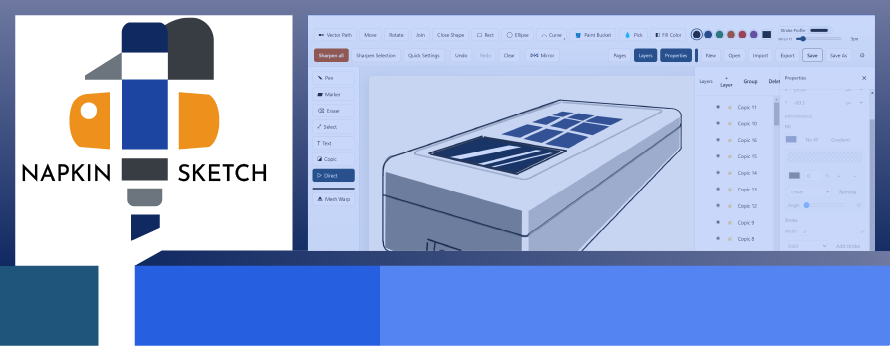

# napkin-sketch

`Ctrl + click` to view [napkin-sketch documentation](https://isocialpractice.github.io/napkin-sketch/index.html)

Quick and easy computer sketching with a drawing GUI that simulates pen and
paper/napkin sketching — featuring an **auto-sharpen** algorithm that turns
stiff, computer-drawn strokes into cleaner, more hand-drawn forms.

Draw with a **mouse, touchscreen, or pen** (pressure-aware), then let
napkin-sketch straighten your lines, round out your circles, square up your
boxes, and re-introduce a subtle organic wobble so the result still reads as
hand-drawn rather than vector-perfect.



**New here?** [QUICKSTART.md](QUICKSTART.md) gets you from a fresh clone to a
sharpened sketch in five minutes, and [CHEATSHEET.md](CHEATSHEET.md) puts every
shortcut, CLI flag, and npm script on one page. Drawing from a script rather
than by hand? [API-QUICKSTART.md](API-QUICKSTART.md) is the whole API in five
steps, [API.md](API.md) is the map of its documentation, and
[API-CHEATSHEET.md](API-CHEATSHEET.md) puts every verb and flag on one page.
The manual itself - every tool, gesture, menu and setting - is on the
[documentation site](https://isocialpractice.github.io/napkin-sketch/index.html),
written from the Markdown in [`docs/site-src/`](docs/site-src/).

## [Features](https://isocialpractice.github.io/napkin-sketch/guide/index.html)

- **Draws like a pen** - pressure-aware pen and marker, a Copic marker with a
  turnable nib, an eraser that reveals the paper, and text:
  [Tools](https://isocialpractice.github.io/napkin-sketch/guide/tools.html),
  [Gestures and input](https://isocialpractice.github.io/napkin-sketch/guide/gestures.html).
- **Sharpens by hand** - squares up boxes and rounds out circles, and keeps a
  wobble: [Sharpening](https://isocialpractice.github.io/napkin-sketch/guide/sharpen.html).
- **Edits like a vector editor** - anchors and handles, stroke profiles, the
  Transform box, Rotate, Mirror and Mesh Warp:
  [Vector paths](https://isocialpractice.github.io/napkin-sketch/guide/vector-paths.html),
  [Transform](https://isocialpractice.github.io/napkin-sketch/guide/transform.html).
- **Keeps things in order** - layers and groups, and pages of any size:
  [Layers](https://isocialpractice.github.io/napkin-sketch/guide/layers.html),
  [Pages](https://isocialpractice.github.io/napkin-sketch/guide/pages.html).
- **Round-trips SVG** - imports another editor's layers, curves and gradients,
  and exports them small, with PNG, JPEG and PDF beside:
  [Import and export](https://isocialpractice.github.io/napkin-sketch/guide/import-export.html).
- **Nine menus and your own keys** - every command in the menu bar, every key
  changeable:
  [Menus and shortcuts](https://isocialpractice.github.io/napkin-sketch/guide/menus-and-shortcuts.html).
- **Writes scripts** - a file, the selected layers or the session's history as
  napkin script: [Automate](https://isocialpractice.github.io/napkin-sketch/guide/automate.html).
- **Draws from scripts** - from a shell, from Node or from any language, with
  no window: [Drawing from a script](#drawing-from-a-script).
- **Embeds** - the editor, or only its engine, in a page of your own:
  [Embedding the editor](#embedding-the-editor).
- **Animates, optionally** - an add-on that draws frames with an AI helper:
  [Animation Mode](#animation-mode).

## [Installation](https://isocialpractice.github.io/napkin-sketch/install.html)

Requires **Node.js 18+**. From a clone:

```bash
npm install
npm run build
npm start          # builds, then opens a new blank sketch
```

`npm link` puts the `napkin-sketch` command on your path, and
`npm run dist:win` (or `dist:mac`, `dist:linux`) builds a native installer into
`release/`.

## [Usage](https://isocialpractice.github.io/napkin-sketch/guide/command-line.html)

```bash
napkin-sketch [option] [target]
```

| Parameter                | Description                                                           |
| :----------------------- | :-------------------------------------------------------------------- |
| `-b, --book`             | Open a saved sketch book file, using the `.skbk` extension.           |
| `-n, --new`              | New sketch, using `unnamed` or the name passed as `[target]`.         |
| `-f, --full-screen`      | Open the GUI window full screen; the default window is maximized.     |
| `-i, --import`           | Import an SVG, PDF, PNG, JPEG, GIF or WebP into the opening sketch.    |
| `-m, --multiple-imports` | Import a comma-separated list of files, laid out in a grid.           |
| `--sharpen`              | Auto-sharpen a saved sketch so it appears more hand-drawn, then open. |

`napkin-sketch draw`, `check`, `render` and `verbs` run with no window at all;
see [Drawing from a script](#drawing-from-a-script).

## [In-app controls](https://isocialpractice.github.io/napkin-sketch/guide/menus-and-shortcuts.html)

`Ctrl` is `Cmd` on macOS. The app opens with the Select tool in hand:

| Do this                 | Press              |
| :---------------------- | :----------------- |
| Draw with the pen       | `P`                |
| Select                  | `S`                |
| Sharpen the whole page  | `H`                |
| Undo / redo             | `Ctrl+Z` / `Ctrl+Shift+Z` |
| Save                    | `Ctrl+S`           |
| Quick Settings          | `Ctrl+,`           |

Every command's keys are in the
[shortcut table](https://isocialpractice.github.io/napkin-sketch/guide/menus-and-shortcuts.html#keyboard-shortcuts)
and in [CHEATSHEET.md](CHEATSHEET.md); **Edit > Edit Keyboard Shortcuts**
changes them. **Help > Verbose** opens this documentation inside the app,
with no network, and **Help > Tool Types** each menu's quickstart.

### [Animation Mode](https://isocialpractice.github.io/napkin-sketch/guide/animation-mode.html)

An optional add-on, not part of a default install, that draws animation
frames with an agentic AI command-line tool you install and sign in to
yourself.

### [Installing Animation Mode](https://isocialpractice.github.io/napkin-sketch/guide/animation-mode.html#installing-animation-mode)

```bash
npm run animation-mode -- --install    # then restart the app
```

### [The graphic-designer helper](https://isocialpractice.github.io/napkin-sketch/ai-helpers.html#the-graphic-designer-helper)

Reads an asset into a design language, then draws more work like it.

### [The scripting helper](https://isocialpractice.github.io/napkin-sketch/ai-helpers.html#the-scripting-helper)

Writes a napkin script from a request, for `napkin-sketch draw --prompt`.

## [How auto-sharpen works](https://isocialpractice.github.io/napkin-sketch/guide/sharpen.html#how-auto-sharpen-works)

Each stroke is classified - straight line, circle or ellipse, polygon, or
freeform - rebuilt as an idealized shape, and given back a small, seeded
wobble so it still reads as drawn by hand.

## [The `.skbk` file format](https://isocialpractice.github.io/napkin-sketch/guide/skbk-format.html)

A sketch book is one human-readable JSON document, written atomically.

## [Embedding the editor](https://isocialpractice.github.io/napkin-sketch/embed.html)

```ts
import { NapkinSketch } from 'napkin-sketch';
import 'napkin-sketch/styles.css';

const editor = new NapkinSketch(document.getElementById('host')!);
```

## [Drawing with the graphic-design API](https://isocialpractice.github.io/napkin-sketch/embed.html#drawing-with-the-graphic-design-api)

Composes pages of text, shapes and images, and renders them to SVG or PNG
with no DOM.

## [Drawing from a script](https://isocialpractice.github.io/napkin-sketch/scripting.html)

```napkin
napkin 1
page 400 300
layer "Card"
color #1f2328 width 3 fill #ffe08a
rect 20 20 360 80 r 12
text "Acme Corp" at 200 70 size 28 align center
```

```bash
napkin-sketch draw card.napkin --to svg,png --out out
```

## [Packaging a desktop installer](https://isocialpractice.github.io/napkin-sketch/develop/building.html#packaging-a-desktop-installer)

```bash
npm run dist
```

## [Testing](https://isocialpractice.github.io/napkin-sketch/develop/testing.html)

```bash
npm test
npm run build && npm run gui-check
```

## [Project structure](https://isocialpractice.github.io/napkin-sketch/develop/project-structure.html)

`src/` holds the app (`main/`, `renderer/`), the command line (`cli/`), the
package entries (`api/`) and the engine and language (`core/`); `docs/api/`
holds the API documentation and `docs/site-src/` the manual.

## [Development](https://isocialpractice.github.io/napkin-sketch/develop/building.html#development)

```bash
npm run build:watch  # Rebuild on change
npm run typecheck    # Type-check without emitting
npm run site         # Rewrite the documentation site from docs/site-src/ and docs/api/
```

## License

MIT
