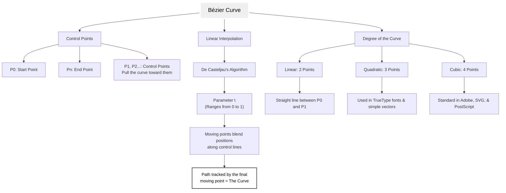
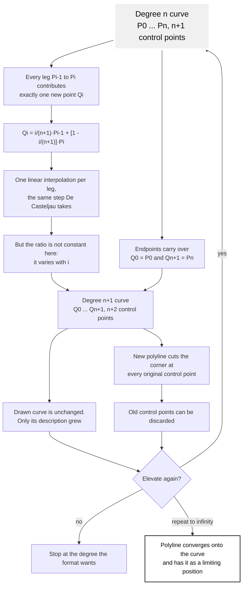

# Vector Graphics

Draw vectors from Bezier curve equations, following the rules of the Bezier
formulas, to produce **simplified** and **resourceful** graphics.

- **Simplified** means the result is easy to maintain and edit, without a
  thicket of cumbersome control points to wade through.
- **Resourceful** means the formulas are applied with enough mathematical
  precision that the number of control points sits at the minimum needed to
  draw the shape, curve, object, or form.

Those two words are the whole standard. A curve that renders correctly but
carries twice the control points it needs has failed it, because every
redundant point is a number somebody has to move the next time the shape
changes.

## When to Use This Skill

- Creating or editing SVG path data, icons, logos, letterforms, or primitives
- Choosing between a line, a quadratic, and a cubic for a segment
- Simplifying a path that has accumulated more control points than its shape
  needs, or that came out of a tracer or a freehand tool
- Converting measured, traced, or sampled points into path data
- Joining segments so they read as one smooth curve rather than as pieces
- Working out where a curve is, where it points, or how big it is, without
  rendering it
- Reviewing geometry for cusps, redundant points, and degenerate handles
- Managing SVG layer structure: naming groups, nesting layer trees, compound
  paths, and carrying structure intact through import/export round trips

## Bezier Curves

A Bezier curve is a smooth, mathematical line used in computer graphics,
fonts, and animation to create shapes that scale up or down without losing
quality.

- **Anchor points**: the exact start and end spots where the curve begins and
  ends. They always lie on the curve.
- **Control points** (*handles*): points that pull and bend the curve toward
  themselves without the curve ever touching them.
- Types:
  - **Linear**: connects 2 points in a straight line.
  - **Quadratic**: uses 3 points (start, end, and 1 control handle).
  - **Cubic**: uses 4 points (start, end, and 2 control handles), the standard
    choice in design software.

### Why We Use Them

- **Infinite scaling**: because they are based on formulas instead of fixed
  pixels, they stay crisp at any size.
- **Easy design**: they turn complex math into simple handles that artists can
  grab and pull with a pen tool.
- **Cheap transforms**: the geometry lives entirely in the control points, so
  rotating or scaling a curve is the same operation applied to a handful of
  points. Nothing has to be re-solved.

## Bezier Formulas

The general formula for a Bezier curve of degree $n$ uses control points
($P_i$) and a parameter $t$ from 0 to 1 to trace a smooth path:

$$B(t) = \sum_{i=0}^{n} \binom{n}{i} (1-t)^{n-i} t^i P_i$$

### Common Bezier Formulas

Depending on how many control points there are, the formula specializes:

- **Linear** (*2 points, degree 1*):
  $B(t) = (1-t)P_0 + tP_1$
- **Quadratic** (*3 points, degree 2*):
  $B(t) = (1-t)^2 P_0 + 2(1-t)t P_1 + t^2 P_2$
- **Cubic** (*4 points, degree 3*):
  $B(t) = (1-t)^3 P_0 + 3(1-t)^2 t P_1 + 3(1-t)t^2 P_2 + t^3 P_3$

### How the Variables Work

- **$t$**: represents time or progress along the curve, moving from the start
  point to the end point.
- **$P_0, P_1, P_2, \dots$**: the control points that pull and shape the
  direction of the curve. Only the first and last points touch the curve.

The coefficients are the **Bernstein polynomials**. They are never negative on
$[0,1]$ and they always sum to 1, which means every point on a curve is a
weighted average of its control points. Two consequences do most of the
practical work:

- **Convex hull**: the curve can never escape the polygon its control points
  form. Bound it, clip it, or reject a hit test without evaluating anything.
- **Affine invariance**: transforming the control points transforms the curve.
  A rotation moves every anchor *and* its handles together, and the result is
  exactly the rotated curve.

## Parts of a Bezier Curve



## Choosing the Degree

Count the bends in the segment, not the complexity of the whole shape. The
count picks the degree, and the degree picks the command.

| Bends | Degree | Command | Numbers per segment |
|-------|--------|---------|---------------------|
| none, it is straight | 1 | `L` | 2 |
| one | 2 | `Q`, or `T` in a chain | 4, or 2 |
| two, it inflects | 3 | `C`, or `S` in a chain | 6, or 4 |
| three or more | split the segment first | several | - |

A quadratic cannot inflect: its second derivative is constant, so it bends one
way for its entire length. A shape that changes its direction of curvature is
either a cubic or two quadratics split at the inflection. Nothing above cubic
is worth authoring, because SVG has no command for it and any renderer will
subdivide it back to cubics.

## Degree Elevation

Many operations that involve two or more Bezier curves require all of them to
carry the same degree, and a higher degree does give more freedom when shaping
a curve, at the cost of more processing. So it is useful to be able to raise a
curve's degree **without changing its shape**. That qualifier is the whole
point: raising the degree while letting the shape move is not degree
elevation, it is just a different curve.

### The Algorithm

Start with a degree $n$ curve defined by the $n+1$ control points
$P_0, P_1, \dots, P_n$. A degree $n+1$ curve needs $n+2$ control points
$Q_0, Q_1, \dots, Q_{n+1}$. Both endpoints are already known, because the new
curve passes through them exactly as the old one did:

$$Q_0 = P_0 \qquad Q_{n+1} = P_n$$

That leaves only $n$ points to find, one for each leg of the original control
polyline. The point $Q_i$ sits on the leg $P_{i-1}P_i$:

$$Q_i = \frac{i}{n+1} P_{i-1} + \left(1 - \frac{i}{n+1}\right) P_i,
\quad i = 1, 2, \dots, n$$

Written out for the first few, so the pattern is visible:

$$Q_1 = \tfrac{1}{n+1}P_0 + \tfrac{n}{n+1}P_1 \qquad
Q_2 = \tfrac{2}{n+1}P_1 + \tfrac{n-1}{n+1}P_2 \qquad
Q_n = \tfrac{n}{n+1}P_{n-1} + \tfrac{1}{n+1}P_n$$

Each new point is one linear interpolation along one leg, which is the same
computation De Casteljau's algorithm performs. The difference is that here the
ratio is **not constant**: it varies with $i$, sliding from near the far end
of the first leg to near the near end of the last.



### Corner Cutting

Once the new points are in hand the old set can be thrown away. Because every
leg of the original polyline gained a point, swapping the old polyline for the
new one reads geometrically as **cutting the corner** at each original control
point. Elevating a degree 4 curve to degree 5 places one new point on each of
its four legs, at these weights:

| $i$ | weight on $P_{i-1}$: $\frac{i}{n+1}$ | weight on $P_i$: $1 - \frac{i}{n+1}$ |
|-----|--------------------------------------|--------------------------------------|
| 1 | 0.2 | 0.8 |
| 2 | 0.4 | 0.6 |
| 3 | 0.6 | 0.4 |
| 4 | 0.8 | 0.2 |

Elevation can be repeated for as long as a system allows. Each pass adds a
control point and moves the polyline nearer the curve, because each pass cuts
the corners again. Taken to the limit, the control polyline converges onto the
curve itself. Measured on a degree 4 curve whose arc length is 8.37, the
polyline shrinks toward it with every elevation:

| Degree | 5 | 6 | 8 | 15 | 29 |
|--------|---|---|---|----|----|
| polyline length | 11.51 | 10.63 | 9.77 | 8.97 | 8.65 |

The drawn curve is identical in all of them. Only the description is getting
longer and hugging tighter.

### When to Elevate

Elevate to satisfy a format or an algorithm that demands a single degree
throughout - joining curve families, blending, or feeding a routine that
assumes cubics. Do not elevate for its own sake: it adds control points that
carry no shape, which is the opposite of a resourceful curve, and the same
degree 4 curve above needs 30 control points at degree 29 to draw what 5 drew.
Elevation is also one-way in practice. Reducing a degree is only an
approximation, because a genuine degree $n$ curve generally has no exact
degree $n-1$ form.

`--elevate` raises a curve one degree. Run it against the curve tabulated
above and the control points change while the path data does not, which is the
whole claim of this section in two commands:

```bash
node scripts/matlib-script.js --points "0,0 1,4 3,5 5,1 6,3"
# quartic (5 control points)
#   control points: [0, 0] [1, 4] [3, 5] [5, 1] [6, 3]

node scripts/matlib-script.js --points "0,0 1,4 3,5 5,1 6,3" --elevate
# quintic (6 control points)
#   control points: [0, 0] [0.8, 3.2] [2.2, 4.6] [3.8, 3.4] [5.2, 1.4] [6, 3]
```

The first new point, $[0.8, 3.2]$, is $0.2 \times [0,0] + 0.8 \times [1,4]$ -
the $i = 1$ row of the table.

## Drawing Method

1. **Break the outline at its landmarks.** Cut where the character of the line
   changes: corners, inflections, the extremes of a curve. Those cuts are the
   anchors, and there should be as few as the shape tolerates.
2. **Count the bends in each piece** and take the degree from the table above.
3. **Place handles by direction and length, not by eye.** The handle leaving
   an anchor sets the direction the curve departs in; its length sets how long
   the curve holds that direction before turning.
4. **Derive rather than drag** whenever the input is known numerically. If
   points on the curve are known, solve for the handles - do not nudge them
   until the shape looks close.
5. **Match handles across every joint that must read smooth.** Collinear
   handles give $G^1$; equal-length collinear handles give $C^1$. In path data
   this is what `S` and `T` do for free.
6. **Count the numbers before finishing.** Every control point that could be
   removed without changing the rendered shape should be removed.

## Rules of Thumb

- **A handle on its own anchor is a bug.** A zero-length handle leaves the
  tangent undefined at that end and shows up as a cusp or a flat spot. Nudge
  it off the anchor.
- **Collinear handles mean the segment is straight.** Write it `L` and save
  four numbers.
- **Prefer a longer handle to an extra point.** Pulling an existing handle
  further out widens the arc; adding a point tightens it locally. Reach for
  the handle first, because it costs nothing new to maintain.
- **Use `S` and `T` in chains.** They infer the leading handle by reflection,
  which makes the join smooth by construction instead of by two coordinates
  that somebody has to keep in agreement.
- **Equal steps in $t$ are not equal steps in distance.** Sampled points bunch
  where the curve is slow and spread where it is fast. Anything needing even
  spacing has to walk arc length or subdivide by flatness.
- **A circle is not a Bezier.** No finite degree draws one exactly. Use
  `<circle>` when a circle is wanted; use the four-cubic approximation with
  handle length $\tfrac{4}{3}(\sqrt{2}-1)r$ only when it must live in a path.

## SVG Path Commands

| Command | Degree | Meaning |
|---------|--------|---------|
| `M x y` | - | move to, start a subpath |
| `L x y` | 1 | line to |
| `H x` / `V y` | 1 | horizontal / vertical line |
| `Q x1 y1 x y` | 2 | quadratic with one handle |
| `T x y` | 2 | quadratic, handle reflected from the previous one |
| `C x1 y1 x2 y2 x y` | 3 | cubic with two handles |
| `S x2 y2 x y` | 3 | cubic, first handle reflected from the previous one |
| `Z` | - | close the subpath |

Lowercase is the relative form of each. `T` and `S` only reflect after a
command of their own family; anywhere else the inferred handle collapses onto
the current point, which is the usual cause of a mysteriously flat segment.

## Layer Management

A vector graphic's integrity is as much structure as geometry. An SVG holds
two descriptions of the same drawing: the curves, and the tree of groups that
says what the curves *are* - which marks form the arm, which sit in front,
which contour is a hole. Tooling that keeps the curves but flattens the tree
hands back a file that renders correctly once and is unmaintainable after;
keep both. The rules below are the conventions that let a file survive round
trips between vector editors with its structure intact.

### Nested Groups Are the Layer Tree

`<g>` nesting is the layers panel. Document order is z-order (later paints on
top), a group's `opacity` multiplies down through everything it holds, and a
wrapper group is never disposable: flattening one away renames or reorders
somebody's layers. An export should emit the tree it was given - a group per
layer, groups nested exactly as the panel nests them - and an import should
build the same tree back.

### Naming Layers Across Editors

One name, written three ways, survives every editor:

- `id` - what Illustrator reads and writes for an object's name.
- `inkscape:label` with `inkscape:groupmode="layer"` - what Inkscape's
  layers panel reads.
- `data-name` - a verbatim copy, free of the id rules below.

XML ids carry two burdens a display name does not. They must be unique, so
editors suffix repeats with `-2`, `-3`, … (`strokes-10` is the tenth layer
named `strokes`), and they cannot hold every character, so illegal ones are
escaped `_xHH_` (`front_x20_arm` reads `front arm`). Undo both when reading a
name back out of an id. And not every id is a name: editors stamp auto-ids on
unnamed elements (`path4521`, `g830`), so a tag name followed by digits names
nothing - but only with the digits, since an author may genuinely call a
layer `line` or `text`.

### Compound Paths Hold Their Contours Together

One `<path>` may hold several contours: `M … Z M … Z`. The winding rule is
what makes an outer contour with an inner one read as a shape with a hole,
and an outlined stroke is exactly that - a thin sliver of outer minus inner.
Split the contours into separate elements and each fills solid: the sliver
becomes a blob that blacks out everything beneath it. One element is one
shape however many subpaths it carries; move, import, or export a compound
shape's contours together or not at all.

### Fill-Only Is a Statement, Not an Omission

A `fill` with no `stroke` means the shape's edge *is* its geometry. Painting
an outline in the fill color anyway grows the shape by half a stroke width
all round, which at icon or sprite scale visibly fattens everything.
Preserve `stroke="none"`, and let small-unit artwork keep sub-unit stroke
widths - a hairline in a 43-unit viewBox is legitimately 0.25 wide.

### Round Trips Preserve Anchors, Not Samples

Import path data by parsing it into anchors, never by sampling along the
length: a curve that arrives as four numbers should leave as four numbers,
not as a polyline through hundreds of samples. Quadratics degree-elevate to
the identical cubic, arcs become quarter-turn cubic pieces with handles
4/3·tan(Δθ/4) along the tangents, and the shape elements (`rect`, `circle`,
`ellipse`, `line`, `polyline`, `polygon`) build from their attributes. Match
written precision to the artwork's units - two decimals in a small viewBox
is the difference between intact and visibly quantized - and write colors as
the source spelled them (`#rrggbb`, not a computed `rgb(r, g, b)`).

## Scripts

`scripts/matlib-script.js` derives curves from their formulas: control points
in, and evaluated points, parametric equations, path data, or a complete SVG
document out. It has no dependencies and no imports, so it runs under both
CommonJS and ESM projects on Node 18 or newer, and can also be required as a
library.

```bash
node scripts/matlib-script.js --points "0,0 1,3 2,-2 3,0" --equation --svg --poly
node scripts/matlib-script.js --points "0,1 1,2 2,0" --through --path
node scripts/matlib-script.js --circle "50,50,40" --svg
node scripts/matlib-script.js --help
```

`scripts/template.md` is the fill-in-the-blank procedure that drives it, from
counting the bends to checking the cost of the finished curve.

## References

Items under skill references expand on topics covered in this document. Links
under external references are pages used to build it.

### Skill References

**`references`**:

- [cubic-bezier-curve.md](references/cubic-bezier-curve.md)
- [linear-bezier-curve.md](references/linear-bezier-curve.md)
- [quadratic-bezier-curve.md](references/quadratic-bezier-curve.md)

**`scripts`**:

- [matlib-script.js](scripts/matlib-script.js)
- [template.md](scripts/template.md)

**`assets`**:

Organized sheets - named parts, safe to lift from and to name after:

- [alphabet.svg](assets/alphabet.svg): two typefaces of letterform paths, a
  sans-serif and a serif, each a group of 26 letter-pair groups holding the
  upper and lower case as one path apiece. The serif set carries the editor's
  `-2` uniquifier throughout (`Aa-2` is still `Aa`) and names its paths for
  the letters (`A`, `a`) where the sans-serif set names them for the roles
  (`upper-case`, `lower-case`). The two `<text>` elements are section labels,
  not letterforms
- [shapes.svg](assets/shapes.svg): squares, circles, ellipses, triangles,
  polygons, stars, lines at set angles, an arc, and a spiral. The shapes are
  bare elements carrying their own ids; only the lines and curves are grouped
- [isometric-objects.svg](assets/isometric-objects.svg) and
  [perspective-objects.svg](assets/perspective-objects.svg): a wheel, a
  sphere, and a cube, drawn once in each projection with matching group names
  (`cube-isometric` against `cube-perspective`, and `back` / `right` /
  `top-left` / `bottom-right` / `top-inside` faces inside each). They are two
  views of one set rather than two sets, so a drawing can be moved between
  projections a face at a time

Studies - loose reference sheets, not a naming contract:

- [male-character-elements.svg](assets/male-character-elements.svg): sheets of
  `legs`, `arms`, `hair-styles`, `clothing`, `movements`, and a `standing`
  figure in `front` and `back`
- [female-character-elements.svg](assets/female-character-elements.svg): the
  same idea with `woman-front` and `woman-back` figures, plus `arms`, `hands`,
  `legs`, `shoes`, `clothes`, `head`, and `facial-expressions`

Both character sheets are very loosely organized: the groups are named as the
artist drew them, they nest inconsistently, and a part may appear more than
once at different angles. Read them for proportion and for what a part looks
like from a given side. Do not measure them, do not expect a stable id, and do
not derive geometry from them automatically - lift a shape, redraw it to the
curve rules above, and name the result yourself.

They earn their place on the requests the organized sheets do not answer: a
character part the animation rig does not draw, a pose asked for in words, or
anything reaching the app's AI helper or the API without a preset behind it.

### External References

- [developer.mozilla.org](https://developer.mozilla.org/en-US/docs/Glossary/Bézier_curve)
- [javascript.info](https://javascript.info/bézier-curve)
- [mathwords](https://www.mathwords.com/b/bezier_curve.htm)
- [pages.mtu.edu](https://pages.mtu.edu/~shene/COURSES/cs3621/NOTES/spline/Bezier/bezier-elev.html)
  (degree elevation)
- [quadratic-bezier-curve](https://www.sciencedirect.com/topics/engineering/quadratic-bezier-curve)
- [wikipedia](https://en.wikipedia.org/wiki/Bézier_curve)
