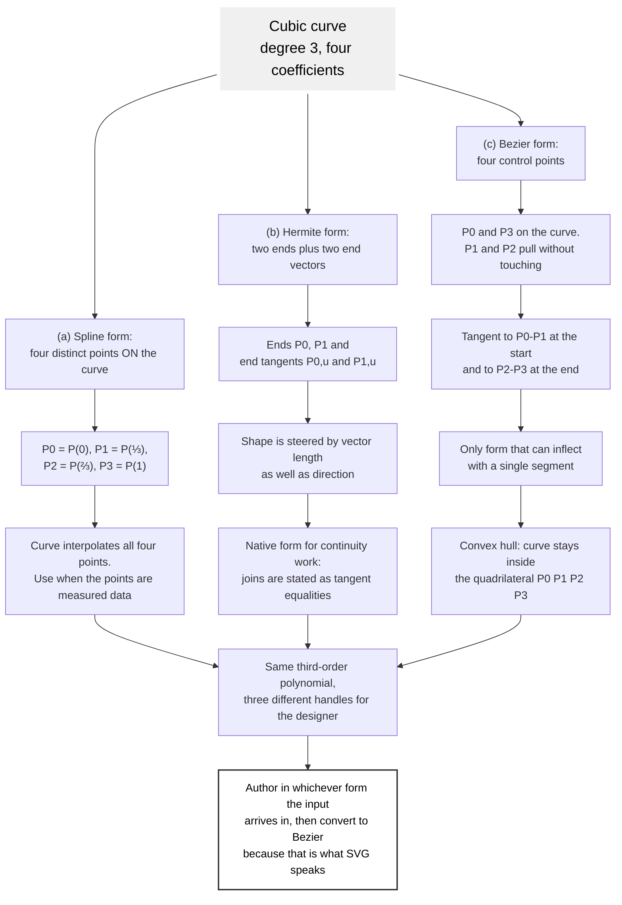
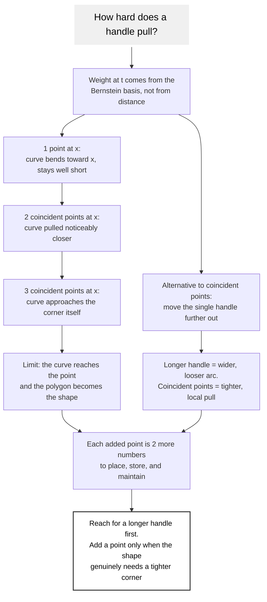
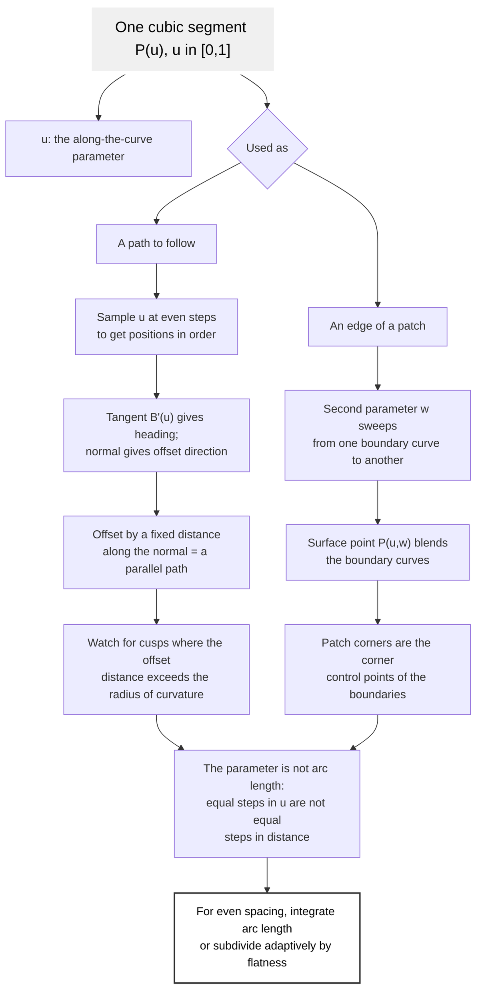

# Cubic Bezier Curve

A cubic Bezier curve is the degree-3 member of the family: two anchors and two
control handles. It is the standard curve of SVG, PostScript, and every
professional vector tool, because it is the lowest degree that can inflect -
bend one way and then the other within a single segment.

## The Equation

$$B(t) = (1-t)^3 P_0 + 3(1-t)^2 t\,P_1 + 3(1-t)t^2 P_2 + t^3 P_3, \quad t \in [0,1]$$

$P_0$ and $P_3$ are the anchors and lie on the curve; $P_1$ and $P_2$ are the
handles and generally do not. The curve leaves $P_0$ heading toward $P_1$ and
arrives at $P_3$ coming from $P_2$.

In matrix form:

$$B(t) = U N_B G_B = \begin{bmatrix} t^3 & t^2 & t & 1 \end{bmatrix}
\begin{bmatrix} -1 & 3 & -3 & 1 \\ 3 & -6 & 3 & 0 \\ -3 & 3 & 0 & 0 \\ 1 & 0 & 0 & 0 \end{bmatrix}
\begin{bmatrix} P_0 \\ P_1 \\ P_2 \\ P_3 \end{bmatrix}$$

The basis functions are the degree-3 Bernstein polynomials
$B_{i,3}(t) = \binom{3}{i} t^i (1-t)^{3-i}$:

$$B_{0,3} = (1-t)^3 \quad B_{1,3} = 3t(1-t)^2 \quad B_{2,3} = 3t^2(1-t) \quad B_{3,3} = t^3$$

They are non-negative and sum to 1, so the curve is a convex combination of
its four control points and stays inside their convex hull.

## Cubic Curve

Like the quadratic, a cubic can be specified three ways, and all three
describe the same third-order polynomial.



The Hermite form is worth keeping in mind even when the output is Bezier,
because it converts by inspection:

$$P_1 = P_0 + \tfrac{1}{3} P_{0,u} \qquad P_2 = P_3 - \tfrac{1}{3} P_{1,u}$$

So "leave this point in this direction at this speed" becomes a handle
position with one division. Going the other way, $P_{0,u} = 3(P_1 - P_0)$ and
$P_{1,u} = 3(P_3 - P_2)$.

## Geometric Modeling

Handles pull; they do not pin. How hard they pull is a property of the basis
functions, and it can be increased by placing control points at the same
location. Each coincident point at a spot raises the weight the curve gives
that spot, dragging the curve toward it and, in the limit, toward the corner
of the control polygon itself.



This is the mechanism behind the resourcefulness rule: a shape that looks like
it needs more control points usually needs its existing handles moved instead.
Adding points is the last resort, not the first move.

## Tool Path Generation

Curves rarely stand alone. In modeling and in machining the same cubic is used
as a boundary that a second parameter sweeps along, which is how a patch, a
sweep, or a machine tool path is built out of curve segments.



The parameter-is-not-arc-length point catches people out constantly. Stepping
$t$ in twenty equal increments places twenty points that are *not* evenly
spaced along the curve: they bunch where the curve is slow and spread where it
is fast. Anything that needs even spacing - dashes, sampled markers, a
constant-feed tool path - must either integrate arc length or subdivide
adaptively until each piece is flat enough to treat as a line.

## Derivative and Curvature

$$B'(t) = 3(1-t)^2 (P_1 - P_0) + 6(1-t)t (P_2 - P_1) + 3t^2 (P_3 - P_2)$$

The derivative is a quadratic Bezier over the *hodograph* points
$3(P_1-P_0)$, $3(P_2-P_1)$, $3(P_3-P_2)$, so tangent and inflection questions
reduce by one degree. Ends: $B'(0) = 3(P_1 - P_0)$ and $B'(1) = 3(P_3 - P_2)$.

A degenerate handle, $P_1 = P_0$, makes $B'(0) = 0$: the curve has no defined
tangent at that end and will show a cusp or a flat spot. Nudge the handle off
the anchor rather than leaving it coincident.

## Continuity Between Segments

When two cubics are joined, the grade of the join is named by what matches at
the junction. For curve $A$ ending and curve $B$ starting:

| Grade | Condition | Reads as |
|-------|-----------|----------|
| $C^0$ | $A_3 = B_0$ | connected, but may have a corner |
| $G^1$ | end tangents collinear | smooth, no corner, speed may jump |
| $C^1$ | end tangents identical | smooth, and parameterized evenly across the join |
| $C^2$ | second derivatives also match | curvature continuous, no visible crease under a highlight |

In control-point terms, $G^1$ means $A_2$, the shared anchor, and $B_1$ are
collinear - the two handles either side of a joint point opposite ways along
one line. $C^1$ adds that they are the same length. This is exactly what a
vector editor enforces when a node is marked "smooth", and it is the rule to
apply by hand when writing path data directly.

## Subdivision and De Casteljau

De Casteljau's algorithm evaluates the curve by repeated linear interpolation
and, as a bonus, splits it exactly at the evaluated $t$:

```text
level 1:  A = lerp(P0,P1,t)   B = lerp(P1,P2,t)   C = lerp(P2,P3,t)
level 2:  D = lerp(A,B,t)     E = lerp(B,C,t)
level 3:  F = lerp(D,E,t)     <- the point on the curve

left half : P0, A, D, F        right half : F, E, C, P3
```

Both halves are exact cubics that together trace the original curve. This is
the workhorse behind hit-testing, flattening, intersection, and trimming, and
it is numerically stable in a way that evaluating the polynomial directly is
not.

## In SVG

| Command | Meaning |
|---------|---------|
| `C x1 y1 x2 y2 x y` | cubic to `x,y` with handles `x1,y1` and `x2,y2` |
| `c dx1 dy1 dx2 dy2 dx dy` | same, relative to the current point |
| `S x2 y2 x y` | cubic whose first handle is the reflection of the previous second handle |
| `s dx2 dy2 dx dy` | same, relative |

```xml
<path d="M 10 80 C 40 10, 65 10, 95 80 S 150 150, 180 80"
      fill="none" stroke="currentColor" />
```

`S` is the resourceful command for a chain and the enforcement mechanism for
$G^1$: reflecting the previous handle through the shared anchor makes the join
smooth by construction and costs four numbers instead of six. As with `T`, it
only reflects after a `C` or another `S`; anywhere else the missing handle
collapses onto the current point.

Two more facts worth carrying:

- A circle cannot be drawn exactly by any Bezier of finite degree. The
  standard four-cubic approximation uses handles of length
  $k \cdot r$ with $k = \tfrac{4}{3}(\sqrt{2}-1) \approx 0.5523$ per quarter,
  which is accurate to about 0.02 percent of the radius. Use the `<circle>`
  element when a real circle is wanted; use the approximation only when the
  circle must be part of a path.
- A cubic with collinear handles is a straight line and should be written `L`.

## As an Easing Function

CSS `cubic-bezier(x1, y1, x2, y2)` is the same equation with $P_0$ fixed at
$(0,0)$ and $P_3$ at $(1,1)$; only the two handles are given. The x axis is
normalized time and the y axis is normalized progress, so the curve maps one
to the other. The x coordinates must stay within $[0,1]$ for the function to
be single-valued in time; the y coordinates may go outside it, which is how
overshoot and anticipation are expressed.

| Keyword | Equivalent |
|---------|-----------|
| `linear` | `cubic-bezier(0, 0, 1, 1)` |
| `ease` | `cubic-bezier(0.25, 0.1, 0.25, 1)` |
| `ease-in` | `cubic-bezier(0.42, 0, 1, 1)` |
| `ease-out` | `cubic-bezier(0, 0, 0.58, 1)` |
| `ease-in-out` | `cubic-bezier(0.42, 0, 0.58, 1)` |

## Worked Example

$P_0 = [0,0]$, $P_1 = [1,3]$, $P_2 = [2,-2]$, $P_3 = [3,0]$:

$$B(t) = \begin{bmatrix} t^3 & t^2 & t & 1 \end{bmatrix} N_B
\begin{bmatrix} 0 & 0 \\ 1 & 3 \\ 2 & -2 \\ 3 & 0 \end{bmatrix}
= [\,3t,\ 15t^3 - 24t^2 + 9t\,]$$

The $x$ component is linear because the control points are evenly spaced in
$x$; all of the shape lives in $y$, which rises, crosses back below zero, and
returns - the inflection a quadratic could not produce. As SVG:
`M 0 0 C 1 3, 2 -2, 3 0`. To generate and check it:

```bash
node scripts/matlib-script.js --points "0,0 1,3 2,-2 3,0" --svg --poly --equation
```

## Related

- [linear-bezier-curve.md](linear-bezier-curve.md): the degree-1 base case
- [quadratic-bezier-curve.md](quadratic-bezier-curve.md): the single-bend case
- [../scripts/template.md](../scripts/template.md): how to drive the curve script

## Sources

- Chang, Kuang-Hua. *Product Design Modeling Using CAD/CAE*, 2014, sections
  2.2.3 (cubic curves, example 2.7) and 2.2.4 (continuities).
- Biran, Adrian. *Geometry for Naval Architects*, 2019, chapter 9 (Bezier curves).
- [developer.mozilla.org](https://developer.mozilla.org/en-US/docs/Web/CSS/easing-function)
