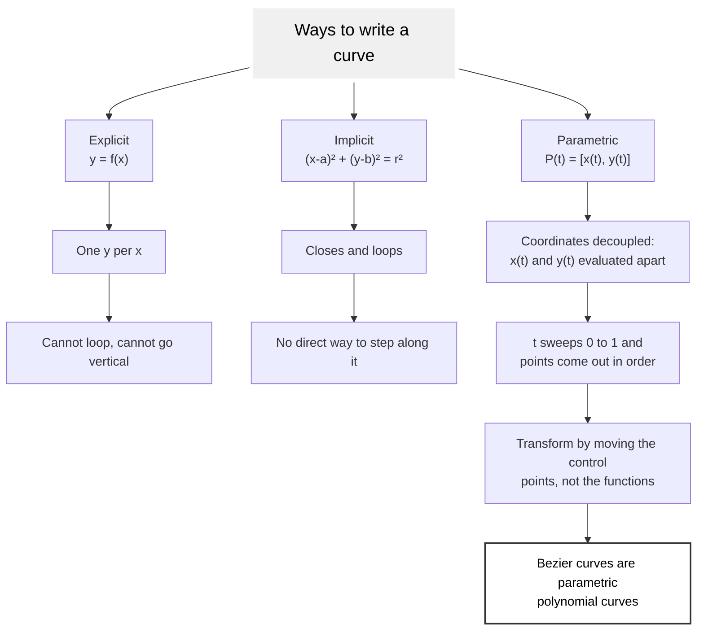

# Linear Bezier Curve

A linear Bezier curve is the degree-1 member of the Bezier family: a straight
segment between two anchor points, with no control handles at all. It is the
base case every higher curve is built from, because De Casteljau's algorithm
reduces a curve of any degree to repeated linear interpolation.

## The Equation

For a start point $P_0$ and an end point $P_1$:

$$B(t) = (1-t)P_0 + t P_1, \quad t \in [0,1]$$

At $t = 0$ the curve is at $P_0$; at $t = 1$ it is at $P_1$. The two basis
functions are $(1-t)$ and $t$, and they sum to 1 for every $t$, which is the
partition of unity that makes the segment an affine combination of its
endpoints.

The same curve in matrix form, which is how the higher degrees are also
written:

$$B(t) = U N_L G_L = \begin{bmatrix} t & 1 \end{bmatrix}
\begin{bmatrix} -1 & 1 \ 1 & 0 \end{bmatrix}
\begin{bmatrix} P_0 \ P_1 \end{bmatrix}$$

- $U$ is the row of powers of $t$, highest first.
- $N_L$ is the constant basis matrix for the degree.
- $G_L$ is the geometry matrix: the control points, one per row.

Working the product back out gives $(1-t)P_0 + tP_1$, so the matrix form and
the direct form are the same curve. Every degree in this skill follows that
$U N G$ shape, only with a wider $U$ and a larger $N$.

## Parametric Curve

The reason vector graphics use $B(t)$ rather than $y = f(x)$ is that a
parametric form can describe shapes a function cannot. An explicit function
gives exactly one $y$ for each $x$, so it can never close a loop; an implicit
equation such as $(x-a)^2 + (y-b)^2 = r^2$ closes but cannot be evaluated
directly for a point. A parametric curve decouples the coordinates into
$x(t)$ and $y(t)$, so a single parameter sweep produces the points in order,
and each coordinate stays an ordinary polynomial that is trivial to evaluate.



A further practical gain: because the geometry lives entirely in the control
points, an affine transform of the curve is the same transform applied to the
control points. Rotating a group of Bezier paths rotates every anchor *and*
every handle together, and the result is exactly the rotated curve. Nothing
has to be re-solved.

## Derivative and Tangent

$$B'(t) = P_1 - P_0$$

The derivative is constant, so a linear segment has one direction for its
whole length and zero curvature. That constant is also the tangent that a
neighbouring curve must match to join smoothly (see the continuity rules in
[cubic-bezier-curve.md](cubic-bezier-curve.md)).

## De Casteljau at Degree 1

De Casteljau's algorithm evaluates a Bezier curve by repeated linear
interpolation. At degree 1 there is a single interpolation and the algorithm
*is* the formula:

```text
lerp(P0, P1, t) = P0 + t * (P1 - P0)
```

Every quadratic evaluation is two of these followed by one more; every cubic
is three, then two, then one. Getting the linear case right is therefore the
whole of the numerical work.

## In SVG

A linear segment is written with a line command, not a curve command:

| Command | Meaning |
|---------|---------|
| `L x y` | line to absolute point |
| `l dx dy` | line by relative offset |
| `H x` / `h dx` | horizontal line (y kept) |
| `V y` / `v dy` | vertical line (x kept) |
| `Z` | close the subpath back to its start |

```xml
<path d="M 10 80 L 190 80" fill="none" stroke="currentColor" />
```

Use the line commands. A quadratic or cubic that happens to be straight costs
extra coordinates, hides the fact that the segment is straight from anyone
editing it later, and can still bend under a rounding error. Two forms of the
same straight segment:

```xml
<!-- resourceful: 2 numbers -->
<path d="M 10 80 L 190 80" />

<!-- wasteful: 6 numbers describing the same straight line -->
<path d="M 10 80 C 70 80, 130 80, 190 80" />
```

The reverse case is worth knowing too. A cubic is straight exactly when both
handles lie on the segment $P_0 P_3$, so a curve that arrives with collinear
handles can be demoted to an `L` with no change to the rendered shape.

## Degree Elevation

Any linear curve can be rewritten as a quadratic or cubic over the same
segment, which is how curves of mixed degree are made to share one
representation:

- to quadratic: $P_0,\ \tfrac{1}{2}(P_0+P_1),\ P_1$
- to cubic: $P_0,\ P_0 + \tfrac{1}{3}(P_1-P_0),\ P_0 + \tfrac{2}{3}(P_1-P_0),\ P_1$

Both are the general elevation algorithm applied at low degree; see **Degree
Elevation** in [SKILL.md](../SKILL.md) for the formula that raises a curve of
any degree, and for why repeated elevation walks the control polyline onto the
curve.

Elevate only when a path format demands a single degree throughout. Elevating
for its own sake adds control points that carry no shape, which is the
opposite of what a resourceful curve does.

## Worked Example

Take $P_0 = [0, 1]$ and $P_1 = [2, 0]$.

$$B(t) = (1-t)[0,1] + t[2,0] = [2t,\ 1-t]$$

Checks: $B(0) = [0,1]$, $B(1) = [2,0]$, $B(\tfrac{1}{2}) = [1, 0.5]$, which is
the midpoint. As SVG: `M 0 1 L 2 0`.

To generate and verify it from the shared script:

```bash
node scripts/matlib-script.js --points "0,1 2,0" --svg
```

## Related

- [quadratic-bezier-curve.md](quadratic-bezier-curve.md): one handle, the `Q` command
- [cubic-bezier-curve.md](cubic-bezier-curve.md): two handles, the `C` command, continuity
- [../scripts/template.md](../scripts/template.md): how to drive the curve script

## Sources

- Chang, Kuang-Hua. *Product Design Modeling Using CAD/CAE*, 2014, section 2.2.1
  (straight line) and 2.2 (parametric curves).
- [developer.mozilla.org](https://developer.mozilla.org/en-US/docs/Web/SVG/Reference/Attribute/d)
