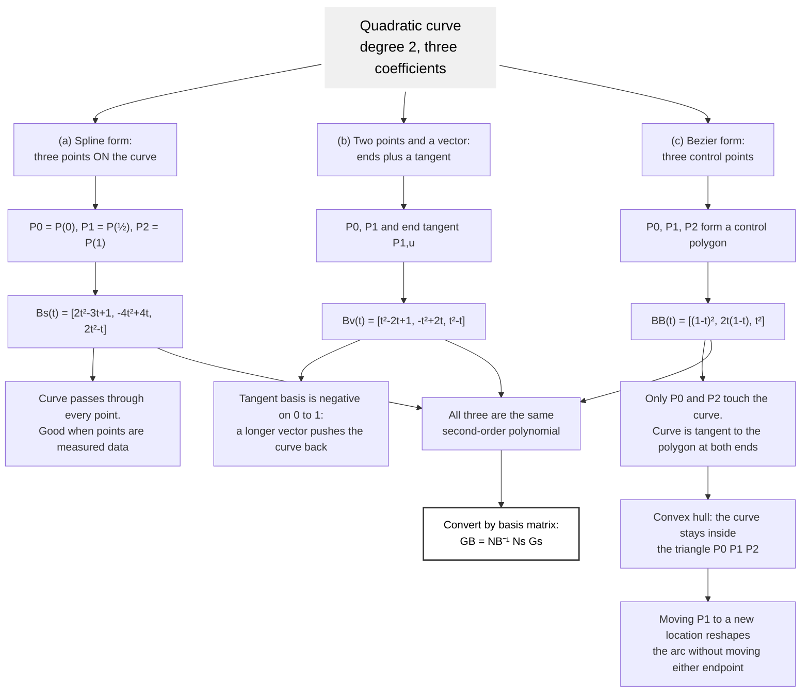
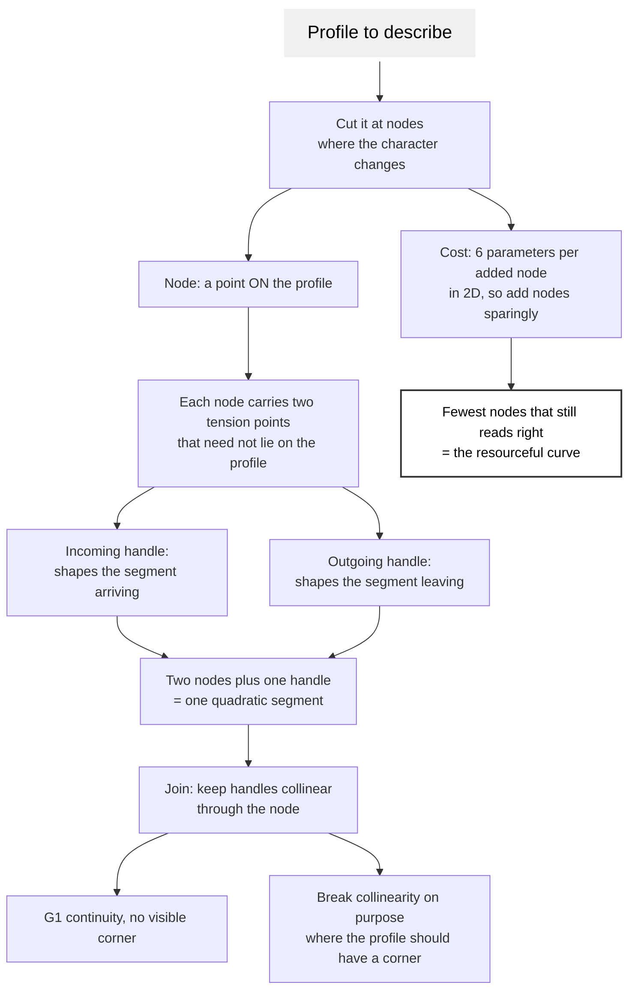

# Quadratic Bezier Curve

A quadratic Bezier curve is the degree-2 member of the family: two anchors and
a single control handle, tracing a parabolic arc. It is the cheapest curve
that can bend, which makes it the most resourceful choice whenever a shape
needs one bend and no inflection.

## The Equation

$$B(t) = (1-t)^2 P_0 + 2(1-t)t\,P_1 + t^2 P_2, \quad t \in [0,1]$$

$P_0$ and $P_2$ are the anchors and lie on the curve. $P_1$ is the control
point; it pulls the curve toward itself but is not touched by it. The curve is
tangent to $P_0 P_1$ at the start and to $P_1 P_2$ at the end, which is what
makes a handle feel like a direction rather than a coordinate.

In matrix form:

$$B(t) = U N_B G_B = \begin{bmatrix} t^2 & t & 1 \end{bmatrix}
\begin{bmatrix} 1 & -2 & 1 \\ -2 & 2 & 0 \\ 1 & 0 & 0 \end{bmatrix}
\begin{bmatrix} P_0 \\ P_1 \\ P_2 \end{bmatrix}$$

The basis functions are the degree-2 Bernstein polynomials:

$$B_{0,2}(t) = (1-t)^2 \qquad B_{1,2}(t) = 2t(1-t) \qquad B_{2,2}(t) = t^2$$

They are non-negative on $[0,1]$ and sum to 1, so every point on the curve is
a convex combination of the three control points. That is the **convex hull
property**: the curve can never leave the triangle $P_0 P_1 P_2$. It is the
single most useful invariant when bounding, hit-testing, or clipping a curve
without evaluating it.

## Quadratic Bezier Curve

The same parabolic arc can be specified three different ways. All three
describe an identical curve; they differ only in what the designer is handed
to manipulate.



Because all three are second-order polynomials, they satisfy
$P(t) = UA = U N_s G_s = U N_v G_v = U N_B G_B$, and a curve authored in one
form converts to another by multiplying through the inverse basis matrix.
That matters in practice: measured points arrive in spline form, but SVG only
speaks Bezier, so the conversion is the bridge.

## Converting Between the Forms

Given a spline curve through $P_0 = [0,1]$, $P_1 = [1,2]$, $P_2 = [2,0]$:

$$G_v = N_v^{-1} N_s G_s = \begin{bmatrix} 0 & 1 \\ 2 & 0 \\ 2 & -7 \end{bmatrix}
\qquad
G_B = N_B^{-1} N_s G_s = \begin{bmatrix} 0 & 1 \\ 1 & 3.5 \\ 2 & 0 \end{bmatrix}$$

All three produce $P(t) = [2t,\ -6t^2 + 5t + 1]$. The useful special case is
the middle row of $G_B$: **a parabola through three points has its Bezier
control point at**

$$P_1^{ctrl} = 2 P(\tfrac{1}{2}) - \tfrac{1}{2}(P_0 + P_2)$$

which for the example gives $2[1,2] - \tfrac{1}{2}([0,1]+[2,0]) = [1, 3.5]$.
That one line turns "the curve should pass through this middle point" into an
SVG `Q` command, and it is the conversion worth memorizing.

## Derivative and Tangent

$$B'(t) = 2(1-t)(P_1 - P_0) + 2t(P_2 - P_1)$$

At the ends, $B'(0) = 2(P_1 - P_0)$ and $B'(1) = 2(P_2 - P_1)$, confirming
that the handle sets the end directions. The derivative is itself a *linear*
Bezier over the points $2(P_1-P_0)$ and $2(P_2-P_1)$, so tangent problems drop
one degree; the same telescoping holds for cubics.

## Method of Splines

Piecewise quadratics are the standard way to describe a profile that must stay
editable: the shape is cut into segments at named nodes, and each node carries
its own tension. The technique comes from engineering profile design (piston
bowls, hull waterlines, cam faces) and transfers directly to drawing.



The cost line is the part that governs how a graphic should be drawn. Every
node added to a two-dimensional profile introduces six more numbers to place
and maintain, so a profile is best described by the fewest nodes that still
reads correctly, with tension doing the work that extra nodes would otherwise
have to do.

## In SVG

| Command | Meaning |
|---------|---------|
| `Q x1 y1 x y` | quadratic to `x,y` with control point `x1,y1` |
| `q dx1 dy1 dx dy` | same, relative to the current point |
| `T x y` | quadratic whose control point is the reflection of the previous one |
| `t dx dy` | same, relative |

```xml
<path d="M 10 80 Q 95 10 180 80" fill="none" stroke="currentColor" />
```

`T` is the resourceful command for a chain: it infers the handle by reflecting
the previous control point through the shared anchor, which both guarantees
smoothness at the join and costs two numbers instead of four.

```xml
<!-- a smooth wave: one full handle, then two inferred ones -->
<path d="M 10 80 Q 40 20 70 80 T 130 80 T 190 80" fill="none" stroke="currentColor" />
```

`T` only reflects after a `Q` or another `T`. Following any other command it
degenerates to a straight line, which is a common source of a mysteriously
flat segment.

## When to Choose Quadratic

Choose quadratic when the segment has **one bend and one bend only**. A
quadratic cannot inflect: its second derivative $2(P_0 - 2P_1 + P_2)$ is
constant, so the curve bends one way for its whole length. If the shape
changes its direction of curvature, either split it at the inflection into two
quadratics or use a cubic.

TrueType fonts are built entirely from quadratics for exactly this reason: a
letterform is a long chain of single-bend segments, and the inferred-handle
chain (`T`) keeps the cost near two numbers per segment.

## Worked Example

$P_0 = [0,1]$, $P_1 = [1,3.5]$, $P_2 = [2,0]$:

$$B(t) = \begin{bmatrix} (1-t)^2 & 2t(1-t) & t^2 \end{bmatrix}
\begin{bmatrix} 0 & 1 \\ 1 & 3.5 \\ 2 & 0 \end{bmatrix}
= [\,2t,\ -6t^2 + 5t + 1\,]$$

As SVG: `M 0 1 Q 1 3.5 2 0`. To generate and check it:

```bash
node scripts/matlib-script.js --points "0,1 1,3.5 2,0" --svg --poly
```

## Related

- [linear-bezier-curve.md](linear-bezier-curve.md): the degree-1 base case
- [cubic-bezier-curve.md](cubic-bezier-curve.md): the inflection case and continuity
- [../scripts/template.md](../scripts/template.md): how to drive the curve script

## Sources

- Chang, Kuang-Hua. *Product Design Modeling Using CAD/CAE*, 2014, section
  2.2.2 (quadratic curves, examples 2.1 to 2.4).
- Benajes, Novella, Pastor, Hernandez-Lopez, Kokjohn. *Computational
  optimization of a combustion system*, Fuel 2018;223:20-31 (method of splines).
- [sciencedirect.com](https://www.sciencedirect.com/topics/engineering/quadratic-bezier-curve)
