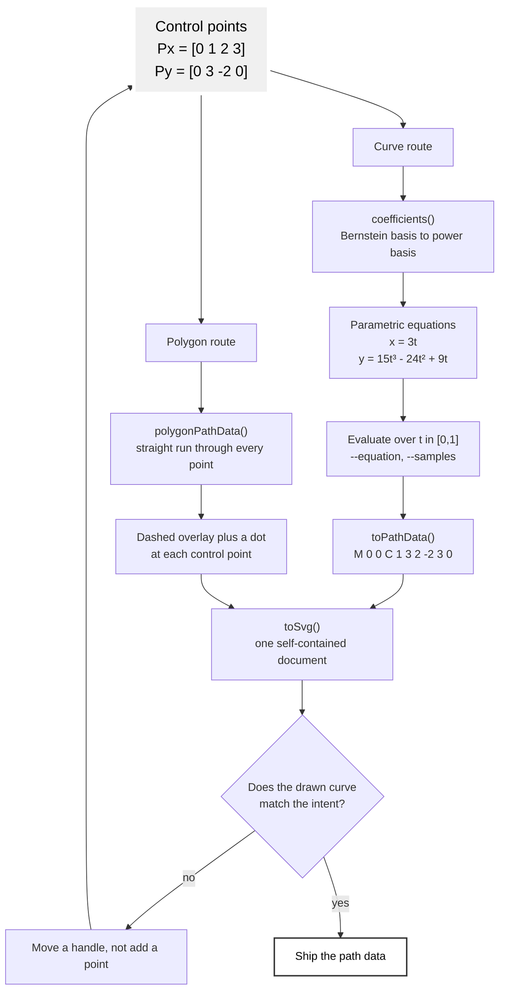

# Curve Template

A fill-in-the-blank procedure for turning a shape description into a Bezier
curve with [matlib-script.js](matlib-script.js). Work top to bottom; each step
names the flag that carries it out.

The script has no dependencies and no imports, so it runs from anywhere Node
18 or newer is installed, under both CommonJS and ESM projects:

```bash
node path/to/matlib-script.js --help
```

## The Pipeline

The script takes the same two routes a plotting session takes: the control
points become a polynomial that draws the curve, and the same control points
become a dashed polygon drawn over it so the handles can be read against the
result.



The polygon overlay is the diagnostic. A curve that will not behave is nearly
always a curve whose handles are pointing somewhere other than where the eye
expects, and that is visible the moment the dashed run is drawn on top.

## Step 1: Count the Bends

Count how many times the segment changes direction of curvature. That count,
not the complexity of the shape, picks the degree.

| Bends in the segment | Degree | Command | Reference |
|----------------------|--------|---------|-----------|
| none, it is straight | 1 | `L` | [linear](../references/linear-bezier-curve.md) |
| one | 2 | `Q` | [quadratic](../references/quadratic-bezier-curve.md) |
| two, it inflects | 3 | `C` | [cubic](../references/cubic-bezier-curve.md) |
| three or more | split it | several | split at the inflections first |

Nothing above cubic: SVG has no command for it, and this script would have to
subdivide it back down to cubics anyway.

## Step 2: State What Is Known

Two kinds of input arrive, and they need different flags.

**Points the curve must pass through** (measured, traced, or picked off a
reference). Give them as they are and let the script solve for the handles:

```bash
node matlib-script.js --points "<x0,y0> <xm,ym> <x1,y1>" --through --path
```

`--through` accepts 2, 3, or 4 on-curve points; with 3 the middle point is
taken at the halfway parameter, with 4 the middle two are at one third and two
thirds.

**Anchors and handle directions** (a shape being designed rather than
matched). Give the control points directly, no `--through`:

```bash
node matlib-script.js --points "<x0,y0> <cx1,cy1> <cx2,cy2> <x1,y1>" --path
```

## Step 3: Derive and Inspect

```bash
node matlib-script.js --points "0,0 1,3 2,-2 3,0" --equation --poly --at 0.5
```

Prints the degree, the control points, the parametric equations, the path
data, the control polygon, the bounding box, the approximate arc length, and
the point, tangent, and normal at the given parameter. Read the equations
before trusting the shape: a coefficient that is zero where a bend was
expected means the handles are not doing what they look like they are doing.

## Step 4: Emit

One curve as path data, to paste into an existing document:

```bash
node matlib-script.js --points "0,1 1,3.5 2,0" --path
# M 0 1 Q 1 3.5 2 0
```

A complete document, with the control polygon drawn over it while the shape is
still being worked out:

```bash
node matlib-script.js --points "0,0 1,3 2,-2 3,0" --svg --poly > curve.svg
```

Drop `--poly` for the finished file. Add `--flip-y` when the coordinates were
worked out in math space, where y grows upward, rather than in SVG space,
where it grows downward.

## Step 5: Check the Cost

Before the curve is finished, count its numbers. A resourceful curve is the
one that uses the fewest control points that still reads correctly, so:

- Is any handle sitting on its own anchor? That is a cusp waiting to happen -
  nudge it off.
- Are both handles collinear with the chord? The segment is straight; write it
  as `L` and save four numbers.
- Are two segments meeting smoothly? Replace the second one's leading handle
  with `S` (or `T` for quadratics) and save two numbers, with the smooth join
  then guaranteed by construction rather than by matching coordinates.
- Did adding a control point fix the shape, or would moving an existing handle
  further out have done the same? Prefer moving.

## Copy-Paste Starting Points

```bash
# straight segment
node matlib-script.js --points "10,80 190,80" --path

# one bend, handle pulling up between the anchors
node matlib-script.js --points "10,80 100,10 190,80" --path

# an S curve, the case a quadratic cannot express
node matlib-script.js --points "10,80 60,10 140,150 190,80" --path

# a curve fitted through three points that were measured, not designed
node matlib-script.js --points "10,80 100,30 190,80" --through --path

# a circle as path data, for when it has to live inside a path
node matlib-script.js --circle "50,50,40" --svg > circle.svg

# even samples in t, as a reminder that they are not even in distance
node matlib-script.js --points "10,80 60,10 140,150 190,80" --samples 9
```

## Using It as a Library

```js
const bezier = require('./matlib-script.js');

const curve = bezier.throughPoints([[0, 1], [1, 2], [2, 0]]);
const d = bezier.toPathData(curve, { precision: 2 });
const { left, right } = bezier.split(curve, 0.5);
const box = bezier.bounds(curve);
```

From an ESM project, reach the same table through `createRequire`:

```js
import { createRequire } from 'node:module';
const bezier = createRequire(import.meta.url)('./matlib-script.js');
```

Exported: `bernstein`, `binomial`, `bounds`, `circle`, `coefficients`,
`deCasteljau`, `derivativePoints`, `elevate`, `equation`, `flatness`,
`length`, `lerp`, `normalAt`, `pointAt`, `polygonPathData`,
`polynomialString`, `round`, `sample`, `split`, `tangentAt`, `toCubics`,
`toPathData`, `toSvg`, `throughPoints`, and the constant `KAPPA`.

## Worked Case

A textbook cubic, start to finish. Control points $P_0 = [0,0]$,
$P_1 = [1,3]$, $P_2 = [2,-2]$, $P_3 = [3,0]$:

```bash
node matlib-script.js --points "0,0 1,3 2,-2 3,0" --equation --poly
```

```text
cubic (4 control points)
  control points: [0, 0] [1, 3] [2, -2] [3, 0]
  x(t) = 3t
  y(t) = 15t^3 - 24t^2 + 9t
  path: M 0 0 C 1 3 2 -2 3 0
  polygon: M 0 0 L 1 3 L 2 -2 L 3 0
  bounds: 0 -0.487 3 1.472
  length: 4.393 (approximate)
```

The x equation is linear because the control points are evenly spaced across
x, so the whole shape lives in y: it rises, crosses back below zero, and
returns. The bounds confirm what the convex hull property predicts - the curve
peaks at about 1.47 while its polygon reaches 3, because a handle pulls and
does not pin.
